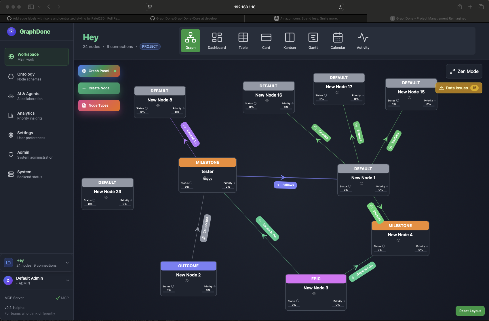

# GraphDone

> Project management for teams who think differently. Coordinate through dependencies and outcomes, not hierarchies and assignments.




## What is GraphDone?

GraphDone reimagines project management as a collaborative graph where work flows through natural dependencies rather than artificial hierarchies. It's designed for high-quality individual contributors who thrive on autonomy, teams that include AI agents, and organizations ready to embrace democratic coordination.

**Key Features:**
- 🌐 **Graph-native collaboration** - Visualize work as interconnected outcomes and dependencies
- 📱 **Mobile-first design** - Touch-friendly interface for distributed teams
- 🤖 **AI agent integration** - Humans and AI coordinate as peers through the same interface
- 🗳️ **Democratic prioritization** - Anonymous rating system lets good ideas rise organically
- 🎯 **Hierarchical graph navigation** - Browse from high-level goals down to detailed tasks with dynamic levels of detail
- 🌍 **Open source** - MIT licensed with no vendor lock-in

## How GraphDone Differs from Traditional PM Tools

| Traditional PM | GraphDone |
|----------------|-----------|
| Hierarchical task assignment | Natural dependency flows |
| Manager-driven priorities | Democratic community validation |
| Linear project timelines | Multi-level graph navigation |
| Human-only collaboration | Human + AI peer collaboration |
| Top-down resource allocation | Priority-based resource migration |
| Rigid organizational structure | Emergent network coordination |

## Philosophy

GraphDone is built on the belief that:

- **Work flows through dependencies, not hierarchies** - Real work has natural constraints and sequences that create the actual structure of how things get done
- **People contribute best when they choose how** - High-quality contributors are driven by intrinsic motivation, not external pressure
- **Ideas can come from anywhere** - Innovation doesn't respect organizational hierarchy
- **Collaboration should include all intelligences** - AI agents should be first-class collaborators, not separate tools

[Read our complete philosophy →](./docs/philosophy.md)

## Quick Start

### Prerequisites

GraphDone requires:
- **Node.js 18+** - JavaScript runtime (our setup script can install this automatically)
- **Docker** - For running Neo4j graph database ([Install Docker](https://docs.docker.com/get-docker/))
- **Git** - For version control (usually pre-installed)

### One Command to Rule Them All

```bash
git clone https://github.com/GraphDone/GraphDone-Core.git
cd GraphDone-Core
./start
```

That's it! The script will automatically:
- Check prerequisites and offer to install Node.js if needed
- Install all dependencies including Neo4j drivers and Playwright for testing
- Set up your environment with proper Neo4j configuration
- Start Neo4j database with APOC plugins
- Build the packages
- Launch the development servers
- Seed the database with sample data if empty

Visit **http://localhost:3127** when you see the "GraphDone is Ready!" message.

> 💡 **Don't have Node.js?** No problem! The setup script will detect this and offer to install Node.js 18 for you using nvm (Node Version Manager).

### What You Get

- 🌐 **Web Application**: http://localhost:3127 - Full graph visualization and collaboration interface
- 🔗 **GraphQL API**: http://localhost:4127/graphql - Auto-generated resolvers with @neo4j/graphql  
- 🩺 **Health Check**: http://localhost:4127/health - Service status monitoring
- 🗄️ **Database**: Neo4j 5.15-community with APOC plugins for native graph storage
- 🐳 **Docker Setup**: Development and production containers ready to go
- 🧪 **Testing**: Comprehensive test suite with coverage reporting

### Alternative Quick Commands

```bash
# Quick start without full setup checks
./start quick

# Manual control (advanced users)
./tools/setup.sh  # One-time setup
./tools/run.sh    # Start development servers

# Other commands
./start clean     # Clean and restart fresh
./start status    # Check system status
./start stop      # Stop all services
```

### Troubleshooting

**Docker Permission Denied?**
```bash
# Fix Docker permissions (then restart terminal)
sudo usermod -aG docker $USER
newgrp docker

# Or run the setup with sudo assistance
./start  # Will offer to use sudo automatically
```

**Node.js Missing?**
```bash
./start  # Will offer to install Node.js 18 automatically
```

**Port Already in Use?**
```bash
./tools/cleanup.sh  # Kill any hanging processes
./start             # Try starting again
```

**Cannot Find Module Errors?**
```bash
./start  # Script will automatically detect and install missing dependencies
```

**Service Connection Issues?**
The app now provides user-friendly error messages instead of technical errors. If you see connection issues:
- Check that `./start` completed successfully
- Visit http://localhost:4127/health to verify the server is running
- The error UI will guide you through common troubleshooting steps

## Core Concepts

### Graph Structure
Work is modeled as interconnected **nodes** (outcomes, tasks, milestones) connected by **edges** (dependencies, relationships). Contributors—both human and AI—participate as first-class citizens in this graph.

### Multi-Level Graph Navigation
Work is organized in interconnected graphs at different levels of detail. Browse from strategic goals at the top level down through projects, features, and individual tasks. The system dynamically shows the appropriate level of detail based on what you're exploring.

### Democratic Prioritization
Anyone can propose ideas and assign personal priority. The community validates through anonymous rating. Ideas that gain support naturally migrate toward higher priority and more resources—no executive approval required.

## Documentation

- 📖 **[Complete Technical Overview](./docs/detailed-overview.md)** - Architecture, implementation details, and visual deep-dive
- 🎯 **[Project Philosophy](./docs/philosophy.md)** - Core beliefs and design principles  
- 🚀 **[Getting Started Guide](./docs/guides/getting-started.md)** - Step-by-step setup and first steps
- 🏗️ **[Architecture Overview](./docs/guides/architecture-overview.md)** - System design and technical decisions
- 👥 **[User Flows](./docs/guides/user-flows.md)** - How teams actually use GraphDone
- 🔌 **[API Documentation](./docs/api/graphql.md)** - GraphQL schema and integration guide
- 🚀 **[Deployment Guide](./docs/deployment/README.md)** - Self-hosted and cloud deployment options

## Contributing

GraphDone is built for and by teams who think differently. We welcome contributions that advance our mission of democratic, graph-native coordination.

**High-Impact Areas:**
- Graph algorithms and optimization
- Mobile touch interactions  
- AI agent integration
- Accessibility and neurodiversity support
- Performance for large graphs

**Get Started:**
1. Run `./start` to see the system working locally
2. Read our [philosophy](./docs/philosophy.md) and [architecture](./docs/guides/architecture-overview.md)
3. Pick an area that excites you and matches your skills
4. Join discussions in GitHub Issues and pull requests

[Complete contributing guide →](./docs/detailed-overview.md#contributing)

## License

Open source software licensed under the [MIT License](./LICENSE).

---

*Built with ❤️ for teams who think differently*