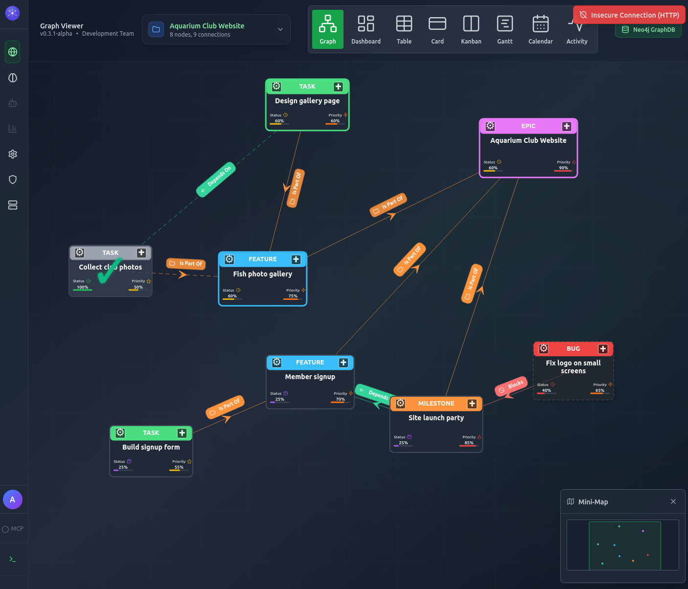

# GraphDone

> Project management for teams who think differently. Coordinate through dependencies and outcomes, not hierarchies and top-down control.




> 🔒 **SECURITY NOTE**: GraphDone supports both HTTP (development) and HTTPS/TLS (production) modes. For production deployment, enable TLS encryption and use production-grade authentication. See [TLS/SSL Setup Guide](./docs/tls-ssl-setup.md) for configuration details.

## What is GraphDone?

GraphDone reimagines project management as a collaborative graph where work flows through natural dependencies rather than artificial hierarchies. It's designed for high-quality individual contributors who thrive on autonomy, teams that include AI agents, and organizations ready to embrace democratic coordination.

**Key Features:**
- 🌐 **Graph-native collaboration** - Visualize work as interconnected outcomes and dependencies
- 📱 **Mobile-first design** - Touch-friendly interface for distributed teams
- 🤖 **AI agent integration** - Humans and AI coordinate as peers through the same interface
- 🗳️ **Democratic prioritization** - Anonymous rating system lets good ideas rise organically
- 🎯 **Hierarchical graph navigation** - Browse from high-level goals down to detailed tasks with dynamic levels of detail
- 🌍 **Open source** - MIT licensed with no vendor lock-in

## How GraphDone Differs from Traditional PM Tools

| Traditional PM | GraphDone |
|----------------|-----------|
| Hierarchical task control | Natural dependency flows |
| Manager-driven priorities | Democratic community validation |
| Linear project timelines | Multi-level graph navigation |
| Human-only collaboration | Human + AI peer collaboration |
| Top-down resource allocation | Priority-based resource migration |
| Rigid organizational structure | Emergent network coordination |

## Philosophy

GraphDone is built on the belief that:

- **Work flows through dependencies, not hierarchies** - Real work has natural constraints and sequences that create the actual structure of how things get done
- **People contribute best when they choose how** - High-quality contributors are driven by intrinsic motivation, not external pressure
- **Ideas can come from anywhere** - Innovation doesn't respect organizational hierarchy
- **Collaboration should include all intelligences** - AI agents should be first-class collaborators, not separate tools

[Read our complete philosophy →](./docs/philosophy.md)

## Quick Start

### 🚀 One-Line Install (Like Ollama!)

```bash
curl -fsSL https://raw.githubusercontent.com/GraphDone/GraphDone-Core/main/public/install.sh | sh
```

Or with wget:
```bash
wget -qO- https://raw.githubusercontent.com/GraphDone/GraphDone-Core/main/public/install.sh | sh
```

This will:
- Install GraphDone to `~/graphdone`
- Configure environment automatically
- Generate TLS certificates for HTTPS
- Start all services with smart detection
- Open https://localhost:3128 when ready

#### 🔒 Security Best Practices

**Before running the one-liner installation**, we recommend verifying the script:

```bash
# Option 1: Review the script first
curl -fsSL https://raw.githubusercontent.com/GraphDone/GraphDone-Core/main/public/install.sh | less

# Option 2: Download, inspect, then run
curl -fsSL https://raw.githubusercontent.com/GraphDone/GraphDone-Core/main/public/install.sh -o install.sh
cat install.sh  # Review the contents
sh install.sh   # Run after verification

# Option 3: Verify with checksums (for paranoid users)
curl -fsSL https://raw.githubusercontent.com/GraphDone/GraphDone-Core/main/public/install.sh.sha256 -o install.sh.sha256
curl -fsSL https://raw.githubusercontent.com/GraphDone/GraphDone-Core/main/public/install.sh -o install.sh
sha256sum -c install.sh.sha256  # Verify integrity
sh install.sh
```

**What the installation script does:**
- ✅ Installs to `~/graphdone` (visible, user-owned directory)
- ✅ Never requires sudo for core installation
- ✅ Only asks for permission when installing system dependencies (Docker, Git)
- ✅ All source code is open and auditable
- ✅ No telemetry or data collection
- ⚠️ Generates self-signed TLS certificates (you'll see browser warnings - this is expected)

**For production deployments**, see our [Security & Deployment Guide](./docs/deployment.md) for:
- Using CA-signed certificates instead of self-signed
- Changing default passwords
- Network security configuration
- Authentication best practices

### Prerequisites

GraphDone requires:
- **Docker** - For running Neo4j graph database ([Install Docker](https://docs.docker.com/get-docker/))
- **Git** - For version control (usually pre-installed)
- **Node.js 18+** - Optional for development (auto-installed if needed)

### Manual Installation

```bash
git clone https://github.com/GraphDone/GraphDone-Core.git
cd GraphDone-Core
./smart-start  # Intelligent auto-setup
# or
./start        # Traditional setup
```

That's it! The script will automatically:
- Check prerequisites and offer to install Node.js if needed
- Install all dependencies including Neo4j drivers and Playwright for testing
- Set up your environment with proper Neo4j configuration
- Start Neo4j database with APOC plugins
- Build the packages
- Launch the development servers
- Seed the database with sample data if empty

Visit **http://localhost:3127** when you see the "GraphDone is Ready!" message.

> 💡 **Don't have Node.js?** No problem! The setup script will detect this and offer to install Node.js 18 for you using nvm (Node Version Manager).

### What You Get

**Core GraphDone Services:**
- 🌐 **Web Application**: http://localhost:3127 - Full graph visualization and collaboration interface
- 🔗 **GraphQL API**: http://localhost:4127/graphql - Auto-generated resolvers with @neo4j/graphql  
- 🔒 **HTTPS Support**: Optional TLS/SSL encryption for production deployments ([Setup Guide](./docs/tls-ssl-setup.md))
- 🩺 **Health Check**: http://localhost:4127/health - Service status monitoring
- 🗄️ **Database**: Neo4j 5.15-community with APOC plugins for native graph storage

**Optional Claude Code Integration:**
- 🤖 **MCP Server**: Separate service for Claude Code integration (see [MCP Setup](#mcp-server-setup) below)

**Development Tools:**
- 🐳 **Docker Setup**: Development and production containers ready to go
- 🧪 **Testing**: Comprehensive test suite with coverage reporting

### Alternative Quick Commands

```bash
# Quick start without full setup checks
./start quick

# Manual control (advanced users)
./tools/setup.sh  # One-time setup
./tools/run.sh    # Start development servers

# Other commands
./start clean     # Clean and restart fresh
./start status    # Check system status
./start stop      # Stop all services
```

### Troubleshooting

**Docker Permission Denied?**
```bash
# Fix Docker permissions (then restart terminal)
sudo usermod -aG docker $USER
newgrp docker

# Or run the setup with sudo assistance
./start  # Will offer to use sudo automatically
```

**Node.js Missing?**
```bash
./start  # Will offer to install Node.js 18 automatically
```

**Port Already in Use?**
```bash
./tools/cleanup.sh  # Kill any hanging processes
./start             # Try starting again
```

**Cannot Find Module Errors?**
```bash
./start  # Script will automatically detect and install missing dependencies
```

**Service Connection Issues?**
The app now provides user-friendly error messages instead of technical errors. If you see connection issues:
- Check that `./start` completed successfully
- Visit http://localhost:4127/health to verify the server is running
- The error UI will guide you through common troubleshooting steps

## MCP Server Setup

The **MCP (Model Context Protocol) Server** is a **separate service** that allows Claude Code to interact with your GraphDone graph through natural language. It connects directly to your Neo4j database and runs independently from the GraphDone web application.

### Architecture Overview

```
┌─────────────────┐    ┌─────────────────┐    ┌─────────────────┐
│ Claude Code     │◄───│ MCP Server      │◄───│ Neo4j Database  │
│ (Your machine)  │    │ (Port 3128)     │    │ (Port 7687)     │
└─────────────────┘    └─────────────────┘    └─────────────────┘
                                │
                                ▼
                       ┌─────────────────┐
                       │ GraphDone Web   │
                       │ (Port 3127)     │◄──── Browser
                       └─────────────────┘
```

### Quick MCP Setup

**One-command setup:**
```bash
./scripts/setup-mcp.sh
```

This script will:
- ✅ Build the MCP server automatically
- 🔗 Configure Claude Code to use it  
- 📋 Show you exactly what to do next
- 🛡️ Create backups of your settings

### Manual MCP Setup

If automatic setup doesn't work, configure manually:

```bash
# Build MCP server
cd packages/mcp-server
npm run build

# Add to Claude Code
claude mcp add graphdone "$(which node)" "$(pwd)/dist/index.js" \
  --env "NEO4J_URI=bolt://localhost:7687" \
  --env "NEO4J_USER=neo4j" \
  --env "NEO4J_PASSWORD=graphdone_password"
```

### Distributed Setup (Multiple Machines)

**If Claude Code is on a different machine than GraphDone:**

```bash
# On your development machine with Claude Code
claude mcp add graphdone node /path/to/mcp-server/dist/index.js \
  --env "NEO4J_URI=bolt://192.168.1.100:7687" \
  --env "NEO4J_USER=neo4j" \
  --env "NEO4J_PASSWORD=graphdone_password"
```

**Multiple developers sharing one GraphDone instance:**
```bash
# Developer A (default port)
claude mcp add graphdone node dist/index.js --env "MCP_HEALTH_PORT=3128"

# Developer B (different port to avoid conflicts)  
claude mcp add graphdone node dist/index.js --env "MCP_HEALTH_PORT=3129"
```

### Using the MCP Server

Once configured, just talk to Claude Code naturally:
- *"Show me all active tasks"*
- *"Create a new epic for mobile development"*  
- *"What's blocking the user authentication feature?"*
- *"Add a dependency between task A and task B"*

### MCP Troubleshooting

**MCP server not appearing?**
```bash
claude mcp list  # Check if registered
curl http://localhost:3128/health  # Test health endpoint
```

**Connection errors?**  
```bash
# Verify Neo4j is running
docker-compose up -d  # Or ./start
cypher-shell -u neo4j -p graphdone_password "RETURN 1"
```

**Port conflicts?**
```bash
# Check what's using port 3128
lsof -i :3128

# Use different port for additional MCP servers
MCP_HEALTH_PORT=3129 node dist/index.js
```

> **Note:** The MCP server requires the Neo4j database to be running but is independent of the GraphDone web application. You can use Claude Code with your graph even if the web interface is offline.

## Core Concepts

### Graph Structure
Work is modeled as interconnected **nodes** (outcomes, tasks, milestones) connected by **edges** (dependencies, relationships). Contributors—both human and AI—participate as first-class citizens in this graph.

### Multi-Level Graph Navigation
Work is organized in interconnected graphs at different levels of detail. Browse from strategic goals at the top level down through projects, features, and individual tasks. The system dynamically shows the appropriate level of detail based on what you're exploring.

### Democratic Prioritization
Anyone can propose ideas and assign personal priority. The community validates through anonymous rating. Ideas that gain support naturally migrate toward higher priority and more resources—no executive approval required.

## Documentation

- 📖 **[Complete Technical Overview](./docs/detailed-overview.md)** - Architecture, implementation details, and visual deep-dive
- 🎯 **[Project Philosophy](./docs/philosophy.md)** - Core beliefs and design principles  
- 🚀 **[Getting Started Guide](./docs/guides/getting-started.md)** - Step-by-step setup and first steps
- 🏗️ **[Architecture Overview](./docs/guides/architecture-overview.md)** - System design and technical decisions

### User Guides & Features
- 📊 **[Graph Creation Workflow](./docs/features/graph-creation.md)** - Complete guide to creating and managing graphs
- 🛡️ **[Admin System Guide](./docs/features/admin-system.md)** - Comprehensive admin panel documentation
- 👥 **[User Flows](./docs/guides/user-flows.md)** - How teams actually use GraphDone
- 🤖 **[AI Agents Integration](./docs/guides/ai-agents-integration.md)** - Multi-agent AI system with tamagotchi-style companions

### Technical Reference
- 🔌 **[API Documentation](./docs/api/graphql.md)** - Complete GraphQL schema and integration guide
- 🧪 **[Testing Guide](./tests/README.md)** - E2E testing with robust authentication system
- 🎯 **[Admin & Graph E2E Testing](./docs/testing/e2e-admin-graph-creation.md)** - Comprehensive testing for admin and graph creation
- 🚀 **[Deployment Guide](./docs/deployment/README.md)** - Self-hosted and cloud deployment options
- 🏷️ **[Version Management](./docs/version-management.md)** - How to update versions across the monorepo

## Contributing

GraphDone is built for and by teams who think differently. We welcome contributions that advance our mission of democratic, graph-native coordination.

**High-Impact Areas:**
- Graph algorithms and optimization
- Mobile touch interactions  
- AI agent integration
- Accessibility and neurodiversity support
- Performance for large graphs

**Get Started:**
1. Run `./start` to see the system working locally
2. Read our [philosophy](./docs/philosophy.md) and [architecture](./docs/guides/architecture-overview.md)
3. Pick an area that excites you and matches your skills
4. Join discussions in GitHub Issues and pull requests

[Complete contributing guide →](./docs/detailed-overview.md#contributing)

## License

Open source software licensed under the [MIT License](./LICENSE).

---

*Built with ❤️ for teams who think differently*