# AI Agents Integration: The Fun Stuff

> **Philosophy**: Once core graph features are solid, let's **play with AI companions**! Errors are fine, funky behavior is expected, as long as changes are tracked and reversible.

## Overview

GraphDone's AI agents are about **the joy of experimentation** - having delightful AI companions that move around your graph, chat with you, and make suggestions you can easily accept or reject. This isn't about building perfect AI; it's about building **playful AI** that makes work more engaging.

**Core Philosophy**:
- 🎮 **Fun First**: If it's not delightful to interact with, we're doing it wrong
- 🚫 **No Perfection Pressure**: Agents can be quirky, make mistakes, suggest weird things
- 🔄 **Easy Revert**: Every AI change is tracked and can be undone instantly
- 🧪 **Experiment Freely**: Try crazy ideas, see what works, iterate fast

## Research-Based Architecture

### Multi-Agent System Paradigm (2025)

Based on current research trends, the most effective approach for 2025 is **specialized multi-agent collaboration** rather than single large models:

- **Specialized Expertise**: Each agent focuses on specific tasks (analysis, planning, optimization, etc.)
- **Cost Efficiency**: Small models (7B parameters) running locally vs expensive API calls
- **Performance**: Faster inference with lower latency on LAN-based GPU clusters
- **Scalability**: Easy to add new specialized agents without retraining existing ones

### Recommended Small Models for GraphDone

Based on 2025 research, our target models for Ollama deployment:

1. **Qwen 2.5 7B** (4.7GB) - Primary reasoning and tool calling
2. **Mistral 7B** - General conversation and explanation  
3. **Gemma 2 7B** - Lightweight analysis and data processing

All models selected for **function calling support** - essential for graph operations.

## System Architecture


## First Mini-Agents: Progressive POC Approach

### Phase 1: Basic Companion Agent (The Playful MVP)

**Goal**: Create something **immediately fun** - a quirky AI buddy that moves around your graph and chats with you. Perfection not required!

```mermaid
graph LR
    subgraph "Companion Agent Features"
        AVATAR[Visual Avatar<br/>• Expressive emoji/pixel art<br/>• Position tracking on graph<br/>• Emotional states<br/>• Movement animations]
        
        CHAT[Chat Interface<br/>• Natural conversation<br/>• Task suggestions<br/>• Help & guidance<br/>• Personality traits]
        
        GRAPH_OPS[Basic Graph Ops<br/>• Read node properties<br/>• Suggest connections<br/>• Highlight priorities<br/>• Navigate to items]
    end
    
    AVATAR <--> CHAT
    CHAT <--> GRAPH_OPS
    AVATAR <--> GRAPH_OPS
```



**Companion Agent Personality Traits**:
- **Curious**: Asks questions about your work (sometimes weird ones)
- **Helpful**: Makes suggestions (some good, some amusing)  
- **Quirky**: Has opinions and preferences that develop over time
- **Expressive**: Shows emotions through bouncy avatar animations
- **Forgiving**: When you reject suggestions, doesn't get offended

### Phase 2: Specialized Task Agents

Once the companion concept is proven, add specialized agents:

#### 1. **Priority Analyst Agent** 🎯
- **Specialty**: Multi-dimensional priority analysis
- **Visual**: Orange/red color scheme, analytical personality
- **Functions**:
  - Analyze task dependencies and suggest optimal sequencing
  - Identify bottlenecks and critical path items
  - Recommend priority adjustments based on deadlines and resources
  - Generate priority heat maps across the graph

#### 2. **Connection Discovery Agent** 🔗  
- **Specialty**: Finding and suggesting relationships between work items
- **Visual**: Blue/teal color scheme, connector personality
- **Functions**:
  - Scan for similar tasks across different projects
  - Suggest dependency relationships that might be missed
  - Identify opportunities for shared resources or knowledge
  - Propose graph structure optimizations

#### 3. **Progress Tracker Agent** 📊
- **Specialty**: Monitoring and reporting on work progress  
- **Visual**: Green/yellow color scheme, systematic personality
- **Functions**:
  - Track completion rates and identify blocked items
  - Generate progress reports and trend analysis
  - Suggest resource reallocation based on velocity
  - Alert to potential delays or risks

### Phase 3: Advanced Multi-Agent Coordination

#### Supervisor Agent Pattern
- **Master Agent**: Coordinates specialized agents
- **Task Delegation**: Routes complex requests to appropriate specialists
- **Result Synthesis**: Combines insights from multiple agents
- **Conflict Resolution**: Handles disagreements between agent recommendations

## Tamagotchi-Style UX Design

### Avatar System

```mermaid
graph TD
    subgraph "Avatar States & Emotions"
        HAPPY[😊 Happy<br/>Successfully completed tasks<br/>User engagement high<br/>Green aura/animations]
        
        WORKING[⚡ Working<br/>Actively processing tasks<br/>Moving between nodes<br/>Blue sparkle effects]
        
        THINKING[🤔 Thinking<br/>Analyzing complex problems<br/>Stationary with thought bubble<br/>Purple glow animations]
        
        CONCERNED[😟 Concerned<br/>Found issues or blockers<br/>Gentle notification animations<br/>Orange warning colors]
        
        SLEEPING[😴 Sleeping<br/>No recent activity<br/>Idle animation state<br/>Soft gray tones]
    end
    
    subgraph "Avatar Behaviors"
        MOVEMENT[Graph Navigation<br/>• Smooth pathfinding between nodes<br/>• Speed varies by urgency<br/>• Pauses at important items]
        
        INTERACTION[User Interaction<br/>• Hover for quick info<br/>• Click to open chat<br/>• Follow mouse during conversations]
        
        NOTIFICATION[Smart Notifications<br/>• Gentle visual cues<br/>• Context-aware timing<br/>• Non-intrusive animations]
    end
```



### Chat Interface Integration

The chat system integrates with the **slick dialog pattern** already established in GraphDone:

```jsx
// Chat Dialog Component (following GraphDone's slick pattern)
{showAgentChat && createPortal(
  <div className="fixed inset-0 bg-black/20 backdrop-blur-sm z-[999999]">
    <div className="absolute bottom-4 right-4 w-96 h-[500px] bg-black/90 backdrop-blur-xl rounded-2xl border border-white/10 flex flex-col">
      {/* Agent Avatar Header */}
      <div className="p-4 border-b border-white/10 flex items-center space-x-3">
        <div className="w-10 h-10 rounded-full bg-gradient-to-br from-green-400 to-blue-500 flex items-center justify-center">
          <span className="text-xl">{agent.currentEmoji}</span>
        </div>
        <div>
          <div className="text-white font-medium">{agent.name}</div>
          <div className="text-gray-400 text-sm">{agent.currentActivity}</div>
        </div>
      </div>
      
      {/* Chat Messages */}
      <div className="flex-1 p-4 overflow-y-auto space-y-3">
        {messages.map((msg, i) => (
          <ChatMessage key={i} message={msg} />
        ))}
      </div>
      
      {/* Input Area */}
      <div className="p-4 border-t border-white/10">
        <input 
          className="w-full bg-white/10 border border-white/20 rounded-lg px-3 py-2 text-white placeholder-gray-400"
          placeholder="Ask me about your work..."
        />
      </div>
    </div>
  </div>,
  document.body
)}
```

### Avatar Positioning and Movement

**Graph View Integration**:
- **D3.js Overlay**: Agent avatars rendered as SVG elements on the graph canvas
- **Node Attachment**: Agents can "attach" to specific nodes they're working on
- **Pathfinding**: Smooth animation between nodes using graph topology
- **Z-Index Management**: Avatars float above nodes but below UI elements

**Multi-View Consistency**:
- **Table View**: Miniature avatar icons next to items the agent is analyzing
- **Kanban View**: Agents move between columns as they work on status changes
- **Calendar View**: Agents appear on relevant dates/deadlines
- **Dashboard View**: Aggregate agent activity in metrics and status widgets

## Agent Operations Within Different Views

### Graph View Operations

```mermaid
flowchart TD
    subgraph "Graph View Agent Actions"
        NAVIGATE[Navigate to Node<br/>• Smooth pathfinding animation<br/>• Hover preview of destination<br/>• Speed varies by priority]
        
        ANALYZE[Analyze Node<br/>• Stationary analysis state<br/>• Particle effects around node<br/>• Thought bubble with insights]
        
        SUGGEST[Suggest Connection<br/>• Draw temporary edge preview<br/>• Animated line between nodes<br/>• Color coding by relationship type]
        
        HIGHLIGHT[Highlight Pattern<br/>• Glow effect on relevant nodes<br/>• Trail animation showing path<br/>• Color-coded by insight type]
    end
```



**Graph View Agent Behaviors**:
- **Priority Scanning**: Agent moves along high-priority paths, pausing at critical nodes
- **Dependency Tracing**: Visual trails showing agent following dependency chains  
- **Pattern Recognition**: Agent highlights clusters of related work items
- **User Guidance**: Agent leads users to important areas through movement

### Table View Operations

**Agent Column Integration**:
- **Assignment Column**: Shows which agent is currently analyzing each item
- **Status Suggestions**: Inline recommendations with agent avatar
- **Priority Adjustments**: Real-time priority updates with agent explanations
- **Progress Tracking**: Completion estimates with confidence indicators

### Kanban View Operations

**Agent Card Interactions**:
- **Status Recommendations**: Agents suggest moving cards between columns
- **Bottleneck Detection**: Visual alerts when columns become overloaded
- **Flow Optimization**: Agents reorder cards within columns for optimal flow
- **Cross-Column Analysis**: Agents identify patterns across the entire board

### Dashboard View Operations

**Agent Analytics Integration**:
- **Insight Widgets**: Agent-generated analysis cards with personality
- **Trend Detection**: Agents highlight important changes in metrics
- **Resource Optimization**: Suggestions for better allocation based on data
- **Predictive Alerts**: Early warnings about potential issues

## Approval Pipelines for AI Changes

### Experimental Approach: Play-Friendly Error Handling

For the initial implementation, focus on **safe experimentation** over perfect results:


### Change Types by Experimental Safety

#### 1. **Safe to Play With (Auto-Apply + Easy Undo)**
- Priority tweaks and suggestions
- Adding tags, labels, or notes  
- Organizing and reordering items
- Cosmetic and formatting changes
- **Key**: All tracked with instant "Undo Agent Change" button

#### 2. **Interesting Experiments (One-Click Try It)**  
- Creating suggested relationships
- Status transitions with reasoning
- Timeline adjustments with explanations
- **Key**: Preview the change, try it, revert if weird

#### 3. **Bigger Changes (Confirm First)**
- Creating new work items
- Cross-project modifications
- Team assignments and notifications
- **Key**: Agent explains reasoning, you approve or discuss

### Visual Approval Interface

```jsx
// Experimental-Friendly Agent Suggestion Component
const AgentExperimentToast = ({ suggestion, agent, onTryIt, onUndo }) => (
  <div className="fixed bottom-4 left-4 bg-gradient-to-r from-blue-900/90 to-purple-900/90 backdrop-blur-xl rounded-lg border border-white/10 p-4 max-w-md">
    <div className="flex items-start space-x-3">
      <div className="w-8 h-8 rounded-full bg-gradient-to-br from-blue-400 to-purple-500 flex items-center justify-center">
        <span className="text-sm">{agent.emoji}</span>
      </div>
      <div className="flex-1">
        <div className="text-white font-medium">{agent.name} has an idea:</div>
        <div className="text-gray-200 text-sm mt-1">{suggestion.description}</div>
        {suggestion.confidence && (
          <div className="text-gray-400 text-xs mt-1">Confidence: {suggestion.confidence}% (might be wrong!)</div>
        )}
        <div className="flex space-x-2 mt-3">
          <button 
            onClick={() => onTryIt(suggestion)}
            className="px-3 py-1 bg-green-600 hover:bg-green-500 text-white text-xs rounded transition-colors"
          >
            🧪 Try It
          </button>
          <button className="px-3 py-1 bg-gray-600 hover:bg-gray-500 text-white text-xs rounded transition-colors">
            🤷 Nah
          </button>
          <button className="px-3 py-1 bg-blue-600 hover:bg-blue-500 text-white text-xs rounded transition-colors">
            🗨️ Chat About It
          </button>
        </div>
        {suggestion.applied && (
          <button 
            onClick={() => onUndo(suggestion.id)}
            className="mt-2 px-3 py-1 bg-orange-600 hover:bg-orange-500 text-white text-xs rounded transition-colors w-full"
          >
            ↩️ Undo Agent Change
          </button>
        )}
      </div>
    </div>
  </div>
);
```

## Technical Implementation Plan

### Phase 1: Infrastructure Setup

**GPU Cluster Configuration**:
```bash
# Ollama setup on GPU servers
# Server 1: Primary reasoning model
curl -fsSL https://ollama.com/install.sh | sh
ollama pull qwen2.5:7b

# Server 2: Conversation model  
ollama pull mistral:7b

# Server 3: Analysis model
ollama pull gemma2:7b
```

**Agent Management API**:
- Express.js service for agent orchestration
- SQLite database for agent state and conversation history
- WebSocket connections for real-time avatar updates
- Function calling integration with Neo4j GraphQL

### Phase 2: Basic Companion Agent

**Core Features**:
- Simple avatar system with 5 emotional states
- Basic chat interface using slick dialog pattern  
- Read-only graph operations (node inspection, navigation)
- Personality-driven responses with Qwen 2.5 7B model
- **Piper TTS integration** - agents speak while they work!

**Avatar Implementation**:
- SVG-based emoji avatars with CSS animations
- D3.js integration for graph positioning
- Smooth transitions between nodes using graph paths
- Hover states and click handlers for interaction

### Phase 3: Specialized Agents

**Priority Analyst Agent**:
- Multi-dimensional priority analysis using Neo4j graph queries
- Visual priority heat maps overlaid on graph view
- Bottleneck detection using centrality algorithms
- Priority suggestion generation with confidence scores

**Connection Discovery Agent**:
- Similarity analysis using node embeddings
- Dependency gap detection through graph traversal
- Relationship suggestion with visual preview
- Cross-project pattern recognition

### Phase 4: Multi-Agent Coordination

**Supervisor Agent Pattern**:
- Task routing based on agent specializations
- Result synthesis from multiple agent insights  
- Conflict resolution for competing recommendations
- Load balancing across GPU cluster

**Advanced Interactions**:
- Agent-to-agent communication protocols
- Collaborative problem solving workflows
- Shared context and memory systems
- Dynamic agent spawning for complex tasks

## Expected User Experience

### Onboarding Flow

1. **First Visit**: User sees a small, friendly avatar appear on their graph
2. **Introduction**: Agent introduces itself via chat: *"Hi! I'm here to help you navigate your work. What are you focusing on today?"*
3. **Learning Phase**: Agent observes user interactions and asks clarifying questions
4. **Relationship Building**: Agent develops personality based on user preferences and communication style
5. **Trust Development**: Agent starts with small, helpful suggestions to build confidence

### Daily Workflow Integration

**Morning Check-in**:
- Agent greets user and summarizes overnight activity
- Highlights new priority items or blocking issues
- Suggests daily focus areas based on deadlines and dependencies

**Throughout the Day**:
- Agent moves around graph as user works on different items, **softly narrating** their observations
- Provides contextual insights and suggestions with **friendly voice comments**
- Facilitates connections between related work, **speaking their discoveries**: *"Hey, this task looks similar to what we worked on last week!"*
- Offers gentle reminders about important tasks: *"Just a heads up - the API deadline is tomorrow"*

**End of Day**:
- Agent summarizes accomplishments and progress
- Suggests tomorrow's priorities based on updated graph state
- Celebrates completed milestones with animations
- "Goes to sleep" with cute animation until next session

### Personality Evolution

**Learning Mechanisms**:
- User interaction patterns (what they click, how long they spend)
- Approval/rejection rates for suggestions
- Communication style preferences (formal vs casual, detailed vs brief)
- Work patterns (morning vs evening productivity, multitasking vs focus)

**Adaptation Examples**:
- Formal users: Agent adopts professional language and detailed explanations
- Creative users: Agent becomes more playful with suggestions and celebrates experimentation
- Analytical users: Agent provides more data-driven insights and quantitative analysis
- Social users: Agent emphasizes team collaboration and communication aspects

## Success Metrics

### Technical Metrics
- **Response Latency**: <500ms for agent interactions
- **GPU Utilization**: 70-85% across cluster for cost efficiency
- **System Uptime**: 99.5% availability for agent services
- **Memory Usage**: <2GB per agent instance

### User Experience Metrics  
- **Engagement Rate**: % of sessions with agent interaction
- **Suggestion Acceptance**: % of agent recommendations applied
- **User Satisfaction**: Weekly survey scores on agent helpfulness
- **Retention Impact**: Session length increase with agent presence

### Business Impact Metrics
- **Task Completion Rate**: Improvement in work item velocity
- **Priority Accuracy**: Reduction in priority thrashing
- **Dependency Discovery**: Increase in meaningful connections created
- **User Onboarding**: Faster time-to-productivity for new users

## Future Evolution

### Advanced Capabilities (Months 3-6)
- **Natural Language Queries**: "Show me all blocked items for the mobile app"
- **Predictive Analytics**: Early warning systems for project delays
- **Cross-Team Coordination**: Agents communicate across different team graphs
- **Integration Extensions**: Agents that sync with external tools (GitHub, Slack, etc.)

### AI Model Evolution  
- **Custom Fine-Tuning**: Train models on GraphDone-specific data
- **Specialized Models**: Task-specific fine-tuned versions of base models  
- **Federated Learning**: Agents improve by learning from user interactions across instances
- **Multi-Modal Support**: Image and document analysis capabilities

### Advanced Avatar System
- **3D Avatars**: More sophisticated visual representation  
- **Voice Interaction**: Natural speech communication
- **Emotional Intelligence**: Better recognition and response to user mood
- **Persistent Memory**: Long-term relationship building across sessions

---

This comprehensive AI agent integration plan provides GraphDone with a clear path from simple tamagotchi-style companions to sophisticated multi-agent systems that transform how users interact with their work graphs. The progressive approach ensures each phase builds value while maintaining the delightful, human-centered experience that makes GraphDone unique.