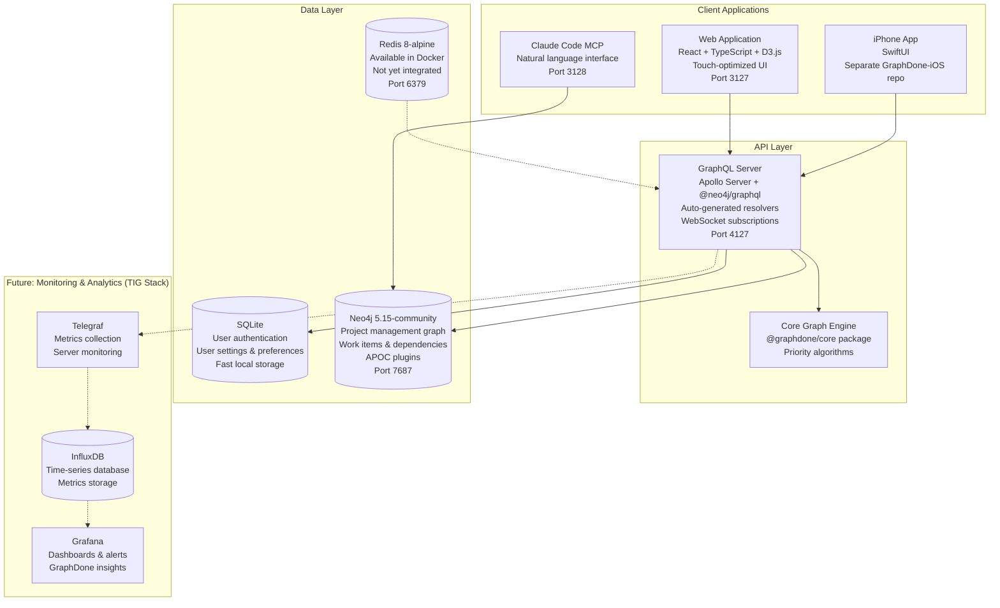
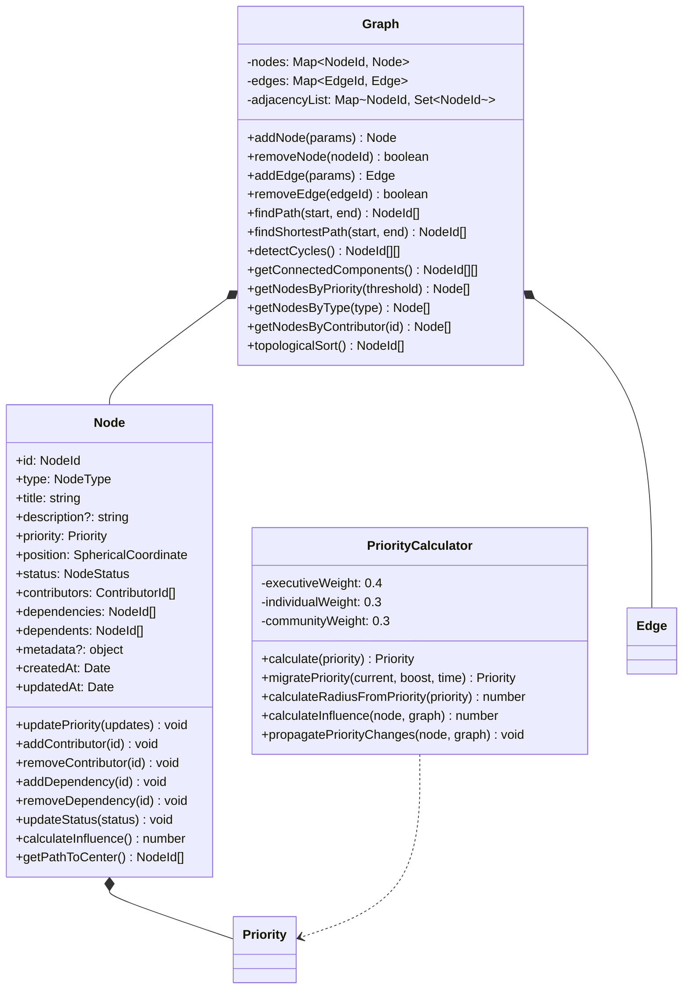
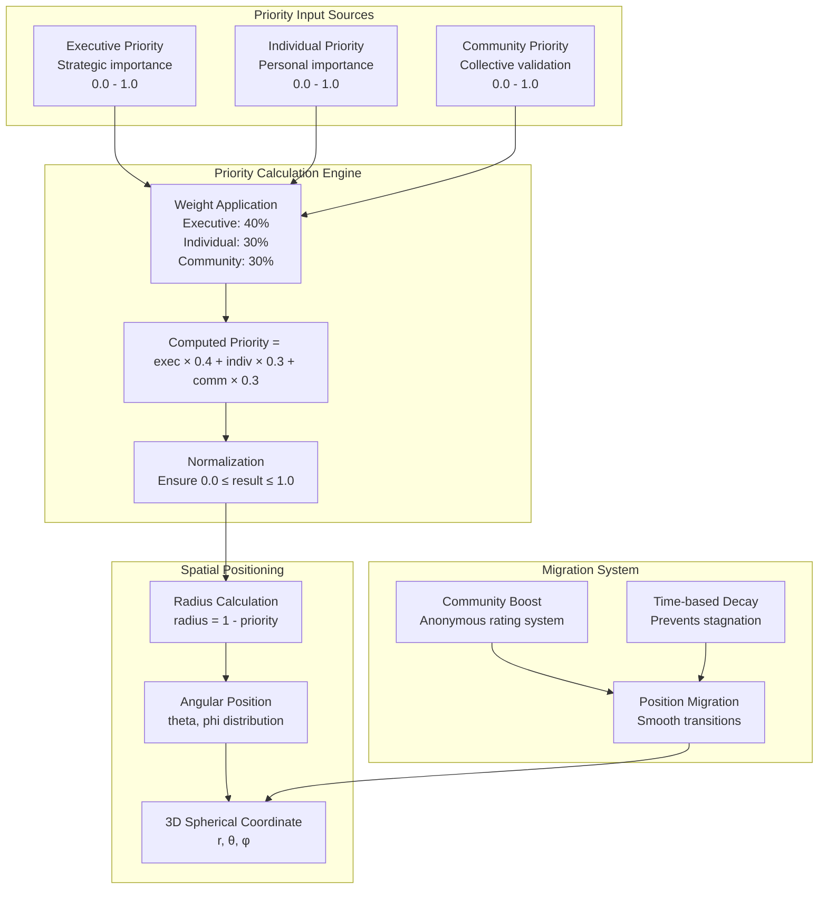
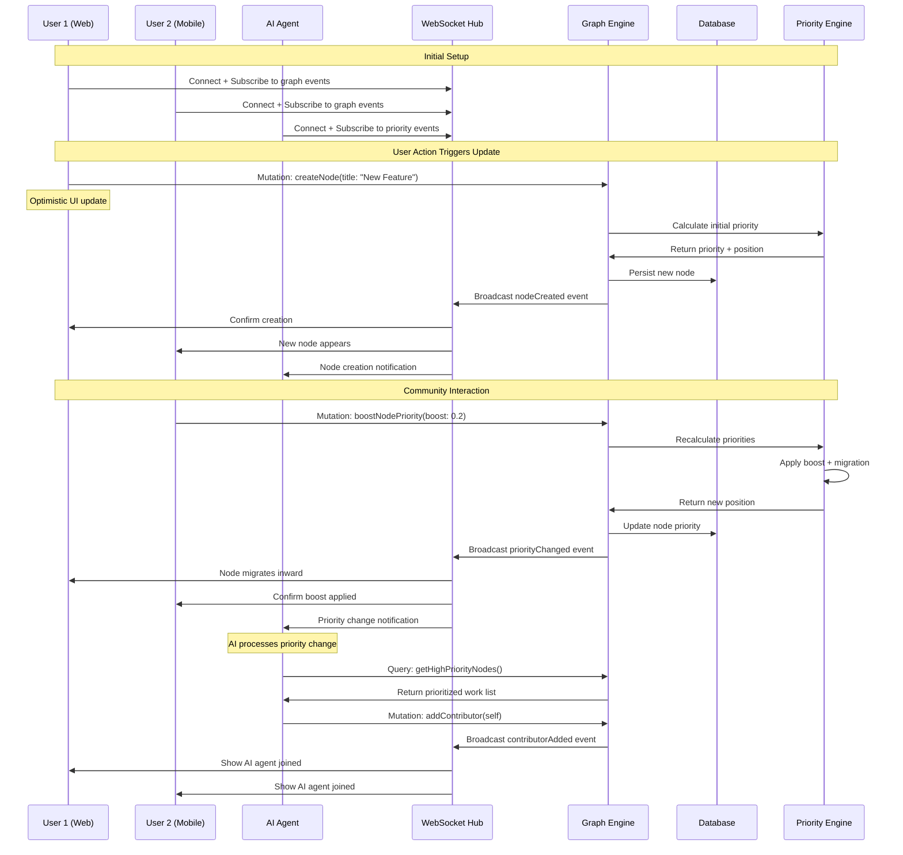
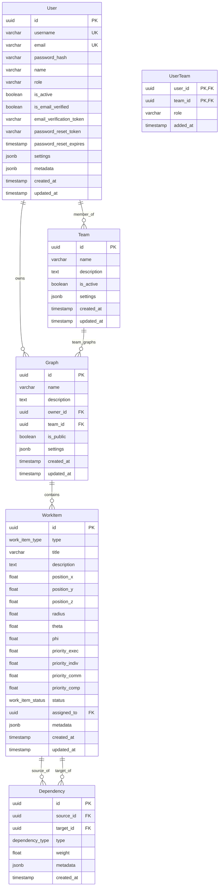
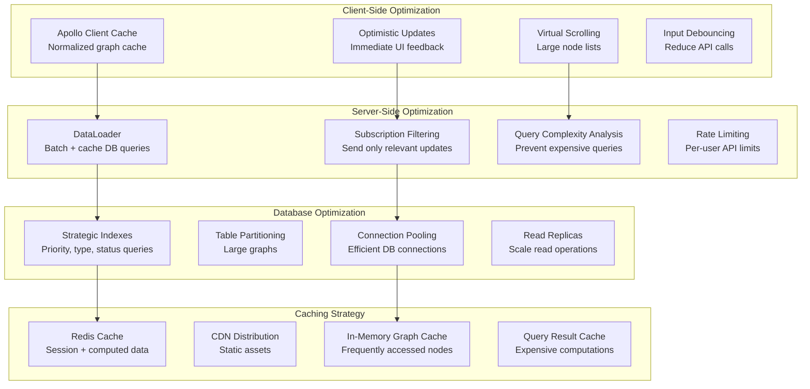
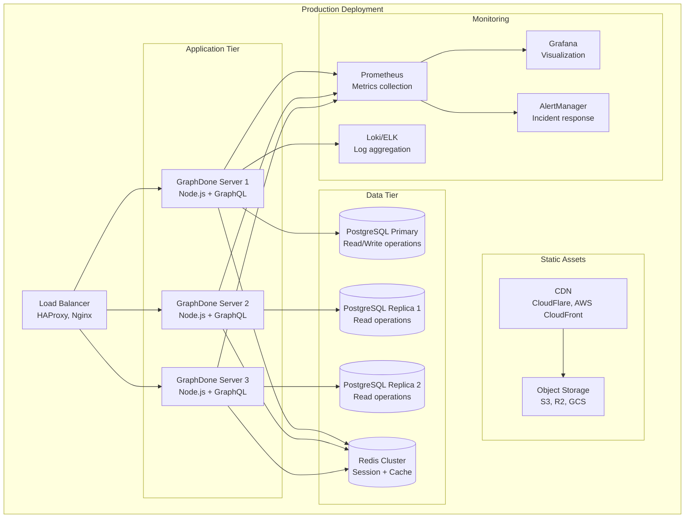
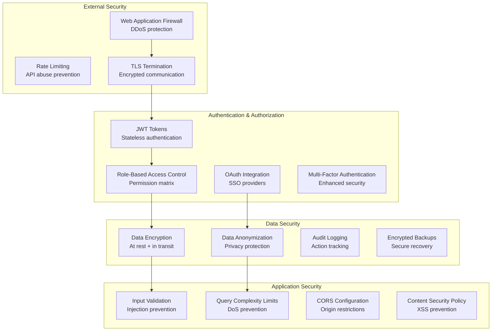

# GraphDone Architecture Overview

## System Architecture Philosophy

GraphDone is architected around three core principles:

1. **Graph-Native**: All operations are modeled as graph transformations
2. **Real-Time First**: Changes propagate immediately to all participants
3. **Democratic Coordination**: Priority emerges from community validation, not top-down assignment

## Current Architecture (v0.3.1-alpha)

## Core Components Deep Dive

### Graph Engine (@graphdone/core)

The graph engine is the heart of GraphDone, implementing all graph operations and algorithms.

### Priority System Implementation

The priority system implements the democratic prioritization philosophy through mathematical algorithms.

### Real-Time Collaboration Architecture

GraphDone maintains real-time synchronization across all clients using a sophisticated event system.

### Hybrid Database Architecture

GraphDone uses a hybrid database approach, optimizing each database for its specific use case:

**SQLite: Authentication & User Data**
- User authentication (login, passwords, tokens)
- User settings and preferences
- Application configuration
- Fast, local storage with ACID properties
- No network latency for auth operations

**Neo4j: Graph Data**
- Project management nodes (tasks, outcomes, milestones)
- Dependencies and relationships between work items
- Graph traversal and pathfinding operations
- Complex graph queries and analytics

**Benefits of Hybrid Architecture:**
- **Performance**: Auth operations are lightning-fast (no network latency)
- **Reliability**: Server can start without Neo4j (auth-only mode)
- **Scalability**: SQLite handles auth load, Neo4j focuses on graph operations
- **Security**: User credentials isolated in separate database
- **Flexibility**: Can switch graph databases without affecting authentication
- **Development**: Easier testing and development with minimal dependencies

### Performance Optimization Strategies

GraphDone implements several performance optimizations for real-time collaboration at scale.

## Deployment Architecture

GraphDone supports multiple deployment patterns from single-server to distributed cloud deployments.

## Security Architecture

Security is implemented at multiple layers with defense in depth principles.

This architecture ensures GraphDone can scale from small teams to large organizations while maintaining the core principles of democratic coordination and real-time collaboration.