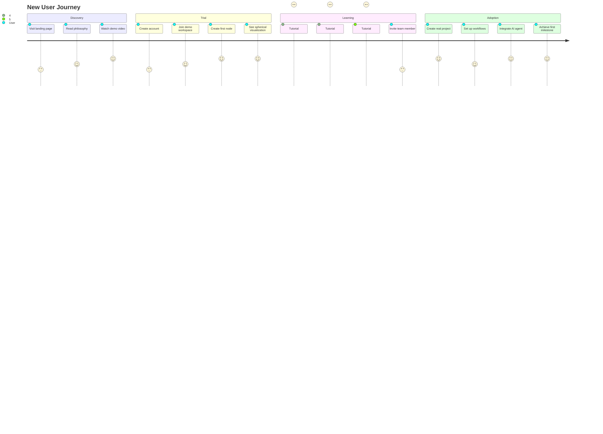
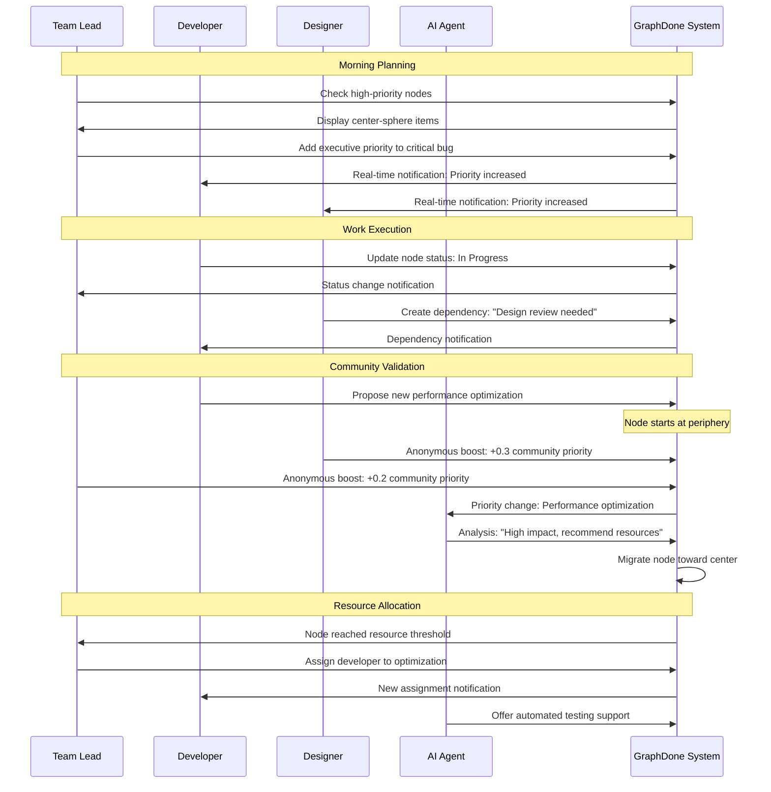
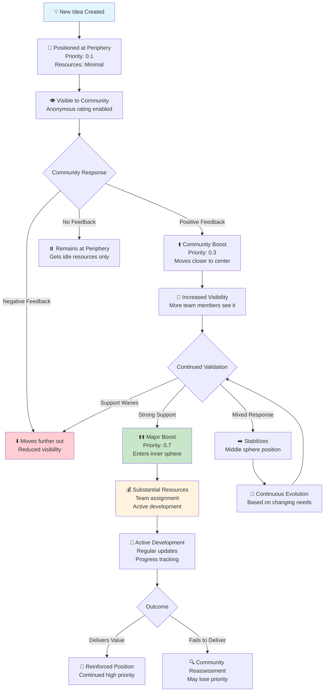
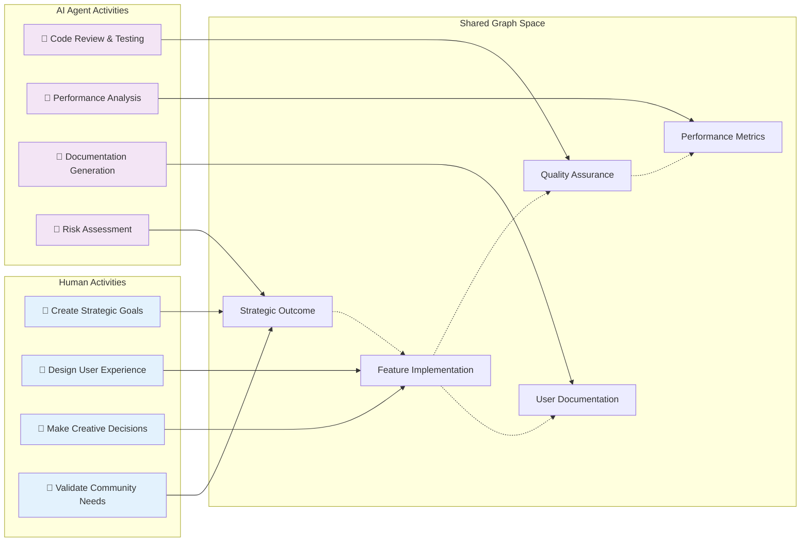
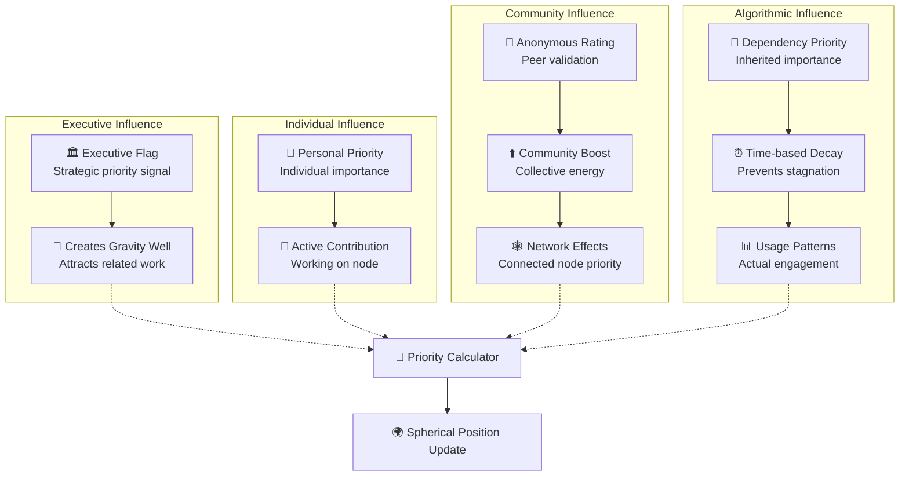
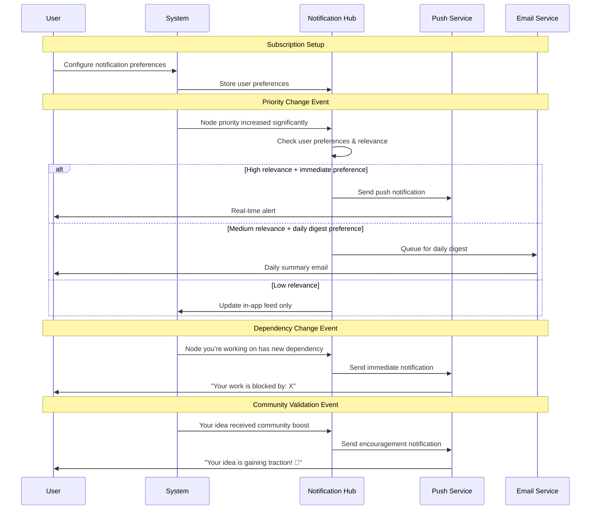
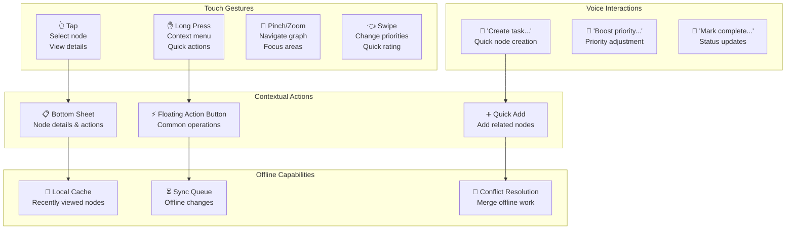
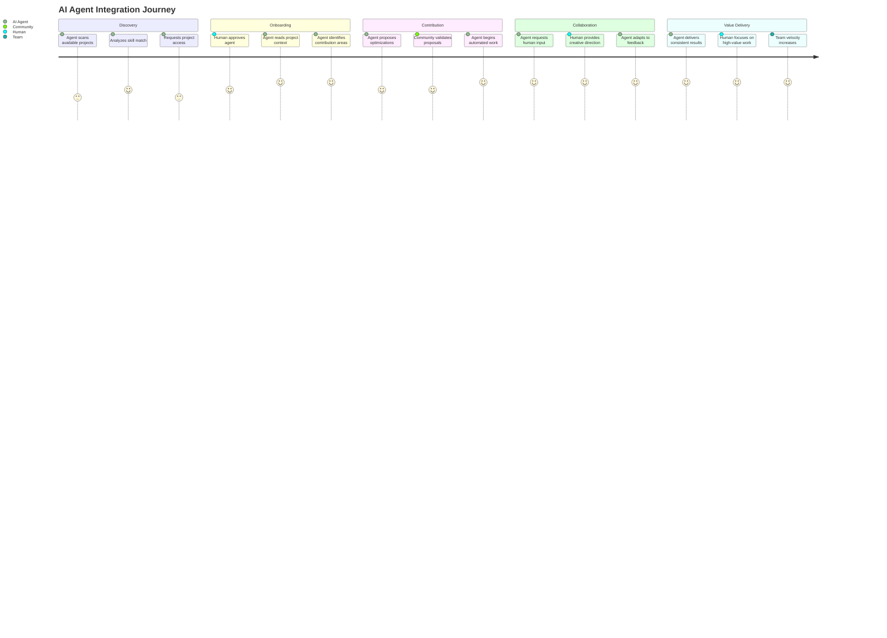
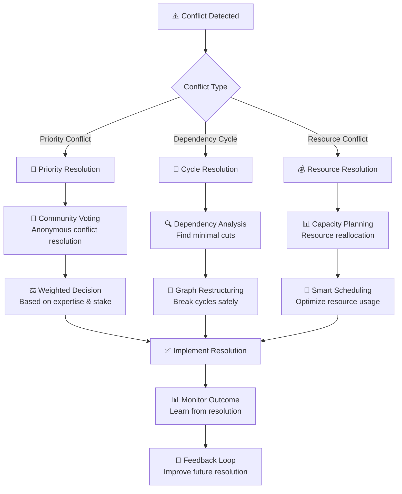
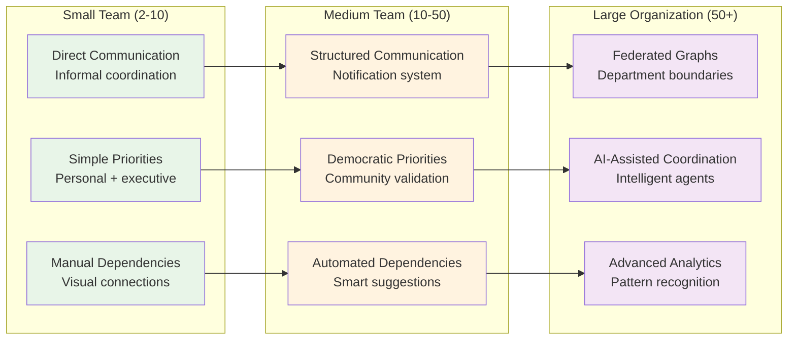

# GraphDone User Flows & Interaction Patterns

## Core User Flows

### 1. New User Onboarding Flow

Understanding how users first experience GraphDone's unique approach to project management.

### 2. Daily Collaboration Flow

How teams use GraphDone for ongoing project coordination.

### 3. Idea Evolution Flow

How ideas migrate from periphery to center through community validation.

### 4. Human-AI Collaboration Patterns

How humans and AI agents coordinate as peers in the graph.

## Interaction Patterns

### Priority Adjustment Patterns

Different ways priority can change in the system.

### Notification & Awareness Patterns

How users stay informed about relevant changes.

### Mobile-First Interaction Patterns

Touch-optimized interactions for mobile devices.

## Advanced User Flows

### AI Agent Integration Flow

How AI agents join and participate in projects.

### Conflict Resolution Flow

How the system handles conflicting priorities and dependencies.

### Scale Transition Flow

How teams transition from small to large scale usage.

These user flows demonstrate how GraphDone's unique approach to project management creates natural, intuitive workflows that scale from individual contributors to large organizations while maintaining the core principles of democratic coordination and human-AI collaboration.