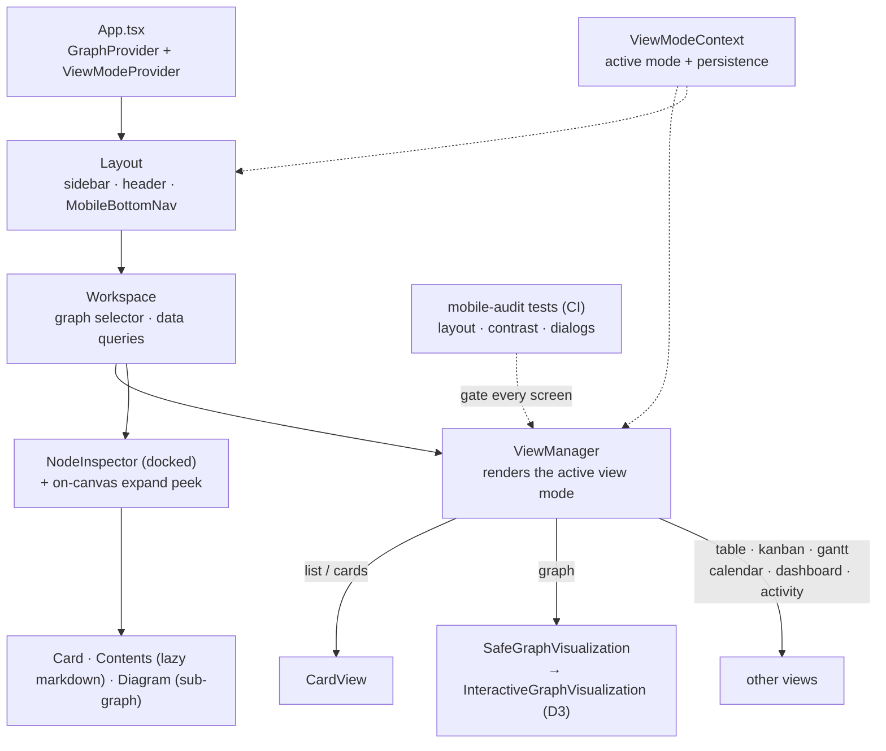

# Web / UI Architecture

How the client (`packages/web`, React 18 + Vite + Tailwind + D3) is structured.
This is the companion to [architecture-overview.md](./architecture-overview.md),
which covers the server / graph engine / data layer.

## Pieces

- **App shell** — `App.tsx` wraps the tree in `GraphProvider` (current graph +
  drill-in/ascend) and **`ViewModeContext`** (`contexts/ViewModeContext.tsx`), the
  single source of truth for the active view, persisted to `localStorage`. `Layout`
  draws the chrome.
- **View system** — `ViewManager` renders one of 8 modes: `cards`, `graph`,
  `table`, `kanban`, `gantt`, `calendar`, `dashboard`, `activity`. Phones default to
  **`cards`** (a readable list); desktop defaults to `graph`.
- **Graph** — `SafeGraphVisualization` error-boundary-wraps
  `InteractiveGraphVisualization`, the D3 force-directed canvas (one-shot physics,
  viewport culling, LOD by zoom — see `LOD_THRESHOLDS`).
- **Node inspector** — a docked `NodeInspector` plus an on-canvas **expand-in-place**
  peek, each with a **Card / Contents / Diagram** toggle readable at any zoom
  (`NodeContentRenderer` lazy-loads markdown/Prism; `NodeSubgraphPreview` draws a
  capped static sub-graph). In-canvas card titles have a zoom-decoupled
  **legibility floor**.

## Responsive tiers (boundary: Tailwind `md`, 768px)

- **Phone (`<md`)** — `MobileBottomNav` (List / Graph / More) is the primary nav;
  slim chrome; the sidebar/desktop header are hidden.
- **Tablet & desktop (`≥md`)** — sidebar rail + full top view-strip + all filters.

## Quality gate

`tests/e2e/mobile-audit.spec.ts` + `mobile-dialogs.spec.ts` run the
`tests/helpers/mobileAudit.ts` auditors (sideways-scroll, squeezed labels,
low-contrast/invisible text, modals clipped under the nav) across **every** screen
at phone width, in CI right after the smoke gate.
