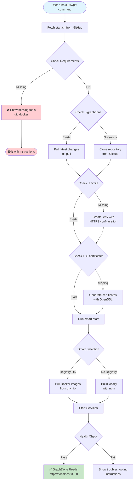
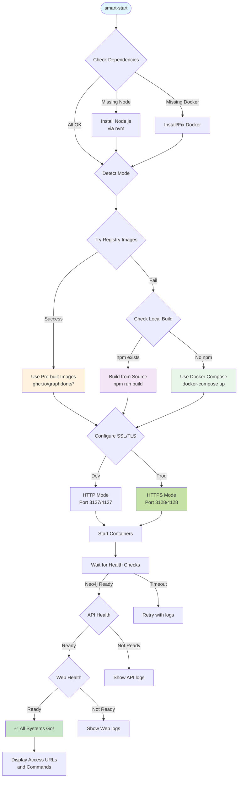
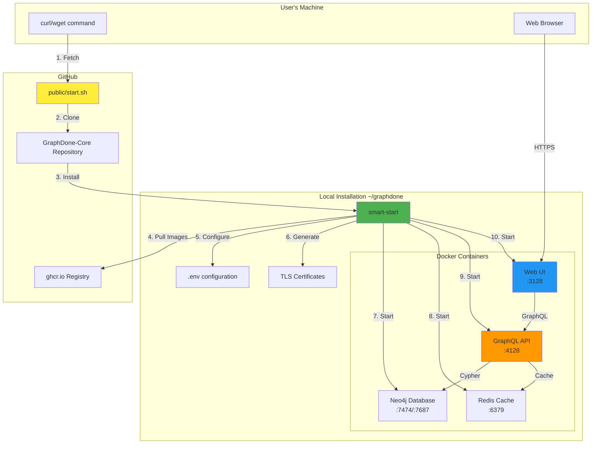
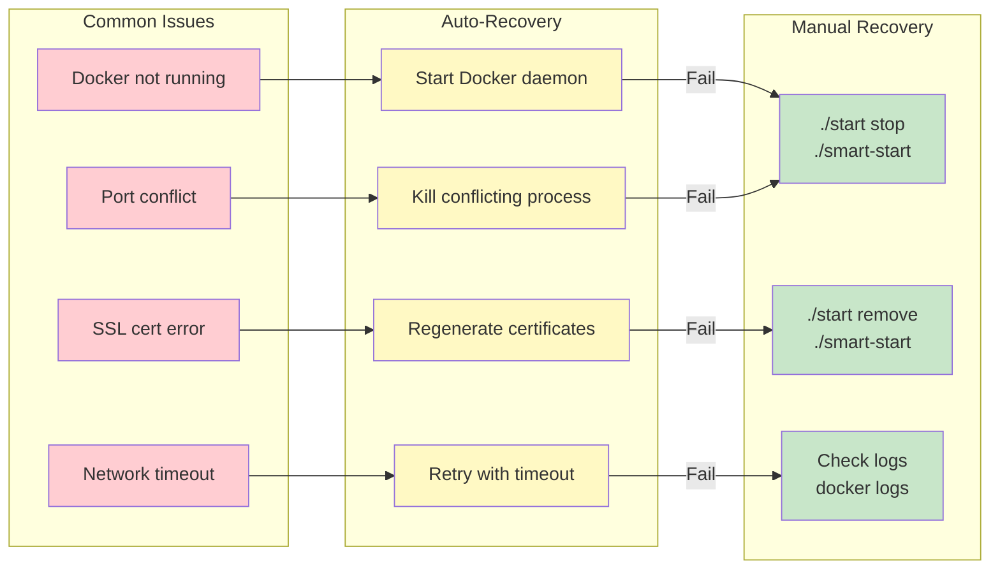
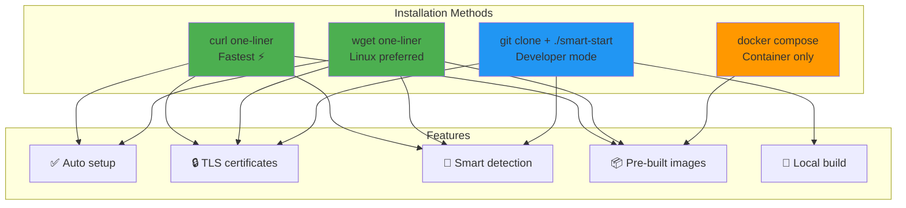

# GraphDone Installation Flow

## One-Liner Installation Process

## Smart-Start Decision Flow

## Service Architecture

## Error Recovery Flow

## Quick Start Options Comparison

## Installation Timeline

```mermaid
gantt
    title GraphDone Installation Timeline
    dateFormat ss
    axisFormat %S
    
    section Download
    Fetch script           :done, fetch, 00, 1s
    Clone repository       :done, clone, after fetch, 5s
    
    section Setup
    Check requirements     :done, req, after clone, 1s
    Create .env           :done, env, after req, 1s
    Generate certificates  :done, cert, after env, 2s
    
    section Docker
    Pull Neo4j image      :active, neo4j, after cert, 10s
    Pull Redis image      :active, redis, after cert, 3s
    Pull API image        :active, api, after cert, 8s
    Pull Web image        :active, web, after cert, 8s
    
    section Start
    Start Neo4j           :crit, startneo, after neo4j, 15s
    Start Redis           :startredis, after redis, 2s
    Start API             :startapi, after api startneo, 5s
    Start Web             :startweb, after web startapi, 3s
    
    section Verify
    Health checks         :milestone, after startweb, 5s
```

