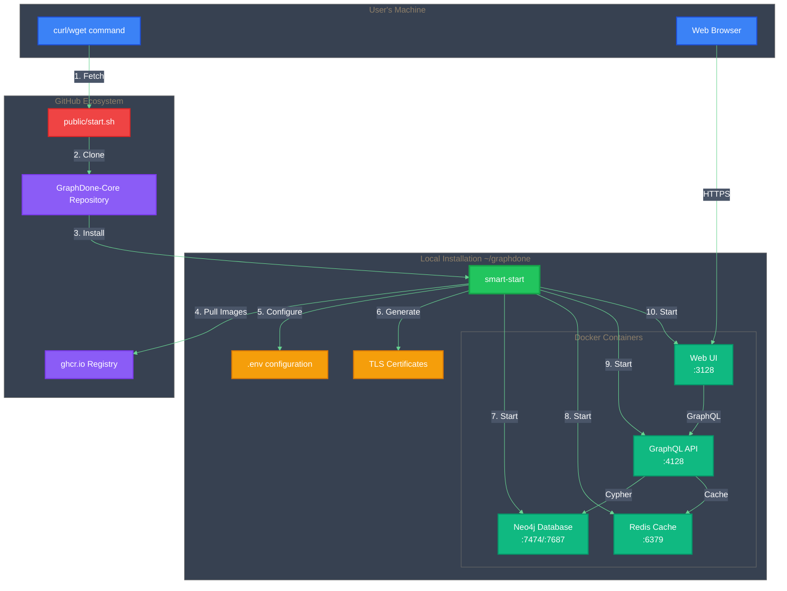
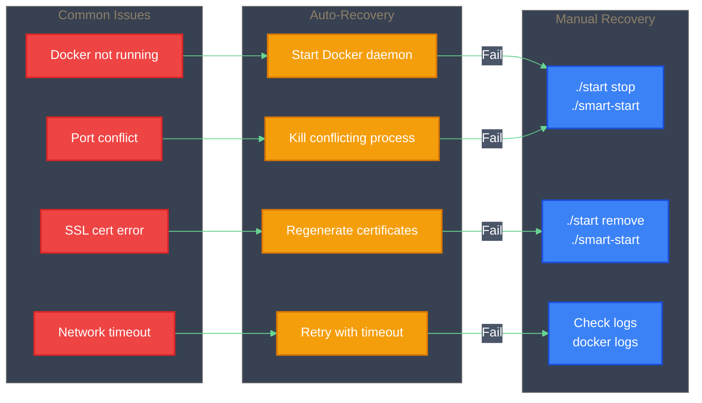
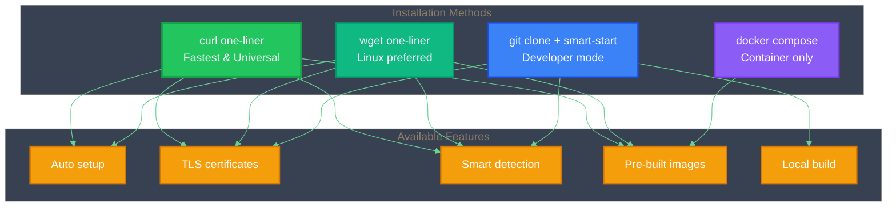
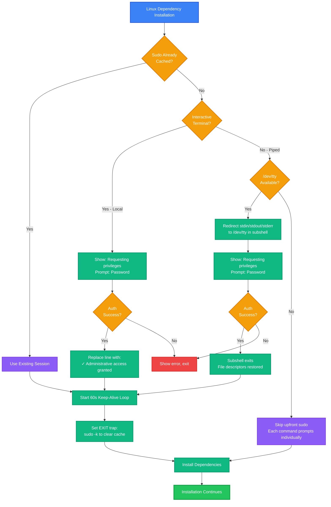

# 🚀 GraphDone Installation Flow

## One-Command Installation Process

The GraphDone installer (`install.sh`) performs a complete automated setup in 9 sections with beautiful CLI progress feedback.

## 📋 Installation Workflow

```mermaid
%%{init: {
  'theme': 'base',
  'themeVariables': {
    'primaryColor': '#2D3748',
    'primaryTextColor': '#FFFFFF',
    'primaryBorderColor': '#4A5568',
    'lineColor': '#68D391',
    'secondaryColor': '#4A5568',
    'tertiaryColor': '#718096',
    'background': '#1A202C',
    'mainBkg': '#2D3748',
    'secondBkg': '#374151',
    'tertiaryBkg': '#4A5568',
    'clusterBkg': '#374151'
  }
}}%%

flowchart TD
    Start([User runs curl/wget]) --> Fetch[Fetch install.sh from GitHub]
    Fetch --> Banner[Display Animated Banner]
    Banner --> Section1[Section 1: Pre-flight Checks]
    
    Section1 --> CheckNetwork{Network OK?}
    CheckNetwork -->|Fail| NetError[Show network error]
    CheckNetwork -->|Pass| CheckDisk{Disk Space?}
    
    CheckDisk -->|< 5GB| DiskWarn[Warn user, ask continue]
    CheckDisk -->|>= 5GB| SpeedTest[Download/Upload Speed Tests]
    DiskWarn -->|Cancel| Exit1([Exit])
    DiskWarn -->|Continue| SpeedTest
    
    SpeedTest --> Section2[Section 2: System Information]
    Section2 --> DetectPlatform{Platform?}
    
    DetectPlatform -->|macOS| CheckMacOS{Version >= 10.15?}
    DetectPlatform -->|Linux| CheckLinux{Supported Distro?}
    DetectPlatform -->|Other| UnsupportedOS([Exit: Unsupported OS])
    
    CheckMacOS -->|No| Exit2([Exit: Upgrade macOS])
    CheckMacOS -->|Yes| Section3
    CheckLinux -->|No| Exit3([Exit: Unsupported Linux])
    CheckLinux -->|Yes| Section3[Section 3: Dependency Checks]
    
    Section3 --> LinuxSudo{Linux Platform?}
    LinuxSudo -->|Yes| CheckSudoCached{Sudo Cached?}
    LinuxSudo -->|No| CheckGit
    
    CheckSudoCached -->|Yes| UseCachedSudo[Use existing sudo session]
    CheckSudoCached -->|No| CheckInteractive{Interactive Terminal?}
    
    CheckInteractive -->|Yes| SudoPromptLocal[Request sudo password locally]
    CheckInteractive -->|No| CheckTTY{/dev/tty Available?}
    
    CheckTTY -->|Yes| SudoPromptPipe[Reconnect to /dev/tty, request sudo]
    CheckTTY -->|No| SkipSudo[Skip upfront sudo, prompt per command]
    
    UseCachedSudo --> StartSudoKeeper[Start 60s sudo keep-alive loop]
    SudoPromptLocal --> StartSudoKeeper
    SudoPromptPipe --> StartSudoKeeper
    SkipSudo --> CheckGit
    StartSudoKeeper --> CheckGit
    
    CheckGit{Git Installed?}
    CheckGit -->|No| InstallGit[Install Git]
    CheckGit -->|Yes| CheckNode
    
    InstallGit -->|macOS| GitHomebrew[Homebrew: brew install git]
    InstallGit -->|Linux| GitAPT[apt/dnf/yum: install git]
    
    GitHomebrew --> CheckNode
    GitAPT --> CheckNode{Node.js >= 18?}
    
    CheckNode -->|No| InstallNode[Install Node.js]
    CheckNode -->|Yes| CheckDocker
    
    InstallNode -->|macOS| NodeHomebrew[Homebrew: brew install node]
    InstallNode -->|Linux| NodeNVM[nvm: install Node 22 LTS]
    
    NodeHomebrew --> CheckDocker
    NodeNVM --> CheckDocker{Docker Running?}
    
    CheckDocker -->|No| InstallDocker[Install Docker]
    CheckDocker -->|Yes| Section4
    
    InstallDocker -->|macOS| DockerOrbStack[Homebrew: brew install orbstack]
    InstallDocker -->|Linux| DockerEngine[Snap/apt: install docker]
    
    DockerOrbStack --> Section4
    DockerEngine --> Section4[Section 4: Code Installation]
    
    Section4 --> CheckRepo{Repo Exists?}
    CheckRepo -->|Yes| PullRepo[git pull latest]
    CheckRepo -->|No| CloneRepo[git clone GraphDone-Core]
    
    PullRepo --> NPMInstall
    CloneRepo --> NPMInstall[npm install dependencies]
    
    NPMInstall --> Section5[Section 5: Environment Configuration]
    Section5 --> CheckEnv{.env Exists?}
    
    CheckEnv -->|Yes| Section6
    CheckEnv -->|No| CreateEnv[Create .env with HTTPS config]
    
    CreateEnv --> Section6[Section 6: Security Initialization]
    Section6 --> CheckCerts{TLS Certs Exist?}
    
    CheckCerts -->|Yes| Section7
    CheckCerts -->|No| GenCerts[Generate self-signed certificates]
    
    GenCerts --> Section7[Section 7: Services Status]
    Section7 --> CheckRunning{Services Running?}
    
    CheckRunning -->|Yes| ShowSuccess[Show success message]
    CheckRunning -->|No| Section8[Section 8: Container Cleanup]
    
    Section8 --> StopOld[Stop old containers]
    StopOld --> RemoveOld[Remove old containers]
    RemoveOld --> Section9[Section 9: Service Deployment]
    
    Section9 --> StartNeo4j[Start Neo4j Database]
    StartNeo4j --> StartRedis[Start Redis Cache]
    StartRedis --> StartAPI[Start GraphQL API]
    StartAPI --> StartWeb[Start React Web App]
    StartWeb --> HealthCheck{All Healthy?}
    
    HealthCheck -->|No| ShowLogs[Show troubleshooting info]
    HealthCheck -->|Yes| ShowSuccess
    
    ShowSuccess --> Complete([Installation Complete!<br/>https://localhost:3128])
    ShowLogs --> Exit4([Exit with logs])
    
    classDef startNode fill:#3B82F6,stroke:#1D4ED8,stroke-width:2px,color:#FFFFFF
    classDef processNode fill:#10B981,stroke:#059669,stroke-width:2px,color:#FFFFFF
    classDef sectionNode fill:#8B5CF6,stroke:#7C3AED,stroke-width:3px,color:#FFFFFF
    classDef decisionNode fill:#F59E0B,stroke:#D97706,stroke-width:2px,color:#FFFFFF
    classDef errorNode fill:#EF4444,stroke:#DC2626,stroke-width:2px,color:#FFFFFF
    classDef successNode fill:#22C55E,stroke:#16A34A,stroke-width:3px,color:#FFFFFF
    
    class Start startNode
    class Banner,SpeedTest,InstallGit,InstallNode,InstallDocker,GitHomebrew,GitAPT,NodeHomebrew,NodeNVM,DockerOrbStack,DockerEngine,PullRepo,CloneRepo,NPMInstall,CreateEnv,GenCerts,StopOld,RemoveOld,StartNeo4j,StartRedis,StartAPI,StartWeb processNode
    class Section1,Section2,Section3,Section4,Section5,Section6,Section7,Section8,Section9 sectionNode
    class CheckNetwork,CheckDisk,DetectPlatform,CheckMacOS,CheckLinux,CheckGit,CheckNode,CheckDocker,CheckRepo,CheckEnv,CheckCerts,CheckRunning,HealthCheck decisionNode
    class NetError,DiskWarn,UnsupportedOS,Exit1,Exit2,Exit3,Exit4,ShowLogs errorNode
    class ShowSuccess,Complete successNode
```



## Smart-Start Decision Flow


## Service Architecture



## Error Recovery Flow



## Installation Methods Comparison



## ⏱️ Installation Timeline

```mermaid
%%{init: {
  'theme': 'base',
  'themeVariables': {
    'primaryColor': '#2D3748',
    'primaryTextColor': '#FFFFFF',
    'primaryBorderColor': '#4A5568',
    'lineColor': '#68D391',
    'secondaryColor': '#4A5568',
    'tertiaryColor': '#718096',
    'background': '#1A202C',
    'mainBkg': '#2D3748',
    'secondBkg': '#374151',
    'tertiaryBkg': '#4A5568',
    'clusterBkg': '#374151'
  }
}}%%

gantt
    title ⚡ GraphDone Installation Journey | 60 Second Setup
    dateFormat ss
    axisFormat %Ss
    
    section DOWNLOAD
    Fetch script from GitHub        :done, fetch, 00, 1s
    Clone GraphDone repository      :done, clone, 01, 5s
    
    section CONFIGURE  
    Verify system requirements      :done, req, 06, 1s
    Create environment config       :done, env, 07, 1s
    Generate SSL certificates       :done, cert, 08, 2s
    
    section IMAGES
    Pull Neo4j Database             :active, neo4j, 10, 10s
    Pull Redis Cache                :active, redis, 10, 3s
    Pull GraphQL API                :active, api, 10, 8s
    Pull Web Interface              :active, web, 10, 8s
    
    section STARTUP
    Initialize Neo4j Database       :crit, startneo, 20, 15s
    Launch Redis Cache              :startredis, 13, 2s
    Start GraphQL API Server        :startapi, 35, 5s
    Deploy Web Application          :startweb, 40, 3s
    
    section SUCCESS
    System health validation        :milestone, health, 43, 5s
    Ready for production use        :milestone, ready, 48, 0s
```



---

## 🔒 Security Verification Flow

**Best Practice**: Verify the installation script before running.

### Verification Options

```bash
# Option 1: Review before running (recommended)
curl -fsSL https://raw.githubusercontent.com/GraphDone/GraphDone-Core/main/public/install.sh | less

# Option 2: Download, inspect, then execute
curl -fsSL https://raw.githubusercontent.com/GraphDone/GraphDone-Core/main/public/install.sh -o install.sh
cat install.sh
sh install.sh

# Option 3: Verify with checksums (production environments)
curl -fsSL https://raw.githubusercontent.com/GraphDone/GraphDone-Core/main/public/install.sh.sha256 -o install.sh.sha256
curl -fsSL https://raw.githubusercontent.com/GraphDone/GraphDone-Core/main/public/install.sh -o install.sh
sha256sum -c install.sh.sha256
sh install.sh
```

### What the Script Does

**Safe Operations:**
- ✅ Installs to `~/graphdone` (user-owned, visible directory)
- ✅ Never requires sudo for core installation
- ✅ Only requests permission for system dependencies
- ✅ All source code is open and auditable
- ✅ No telemetry or data collection

**Expected Behavior:**
- ⚠️ Generates self-signed TLS certificates (browser warnings are normal)
- ⚠️ Creates `~/.graphdone-cache/` for dependency caching
- ⚠️ May modify shell profile if installing Node.js

### Neo4j Configuration Note

GraphDone disables Neo4j's strict configuration validation to handle plugin installation:

```yaml
NEO4J_server_config_strict__validation_enabled: "false"
```

**Why?** Neo4j's automatic plugin downloader (GDS, APOC) occasionally writes malformed entries to `neo4j.conf` during first-time installation. With strict validation enabled, Neo4j refuses to start.

**Is this safe?**
- ✅ Configuration is minimal and well-tested
- ✅ Health checks verify functionality
- ✅ Neo4j runs in isolated Docker container
- ✅ Not exposed externally in production

See [docs/deployment.md](./deployment.md#neo4j-configuration-notes) for complete details.

---

## Professional Design Features

### 🎯 **Optimized for Readability**
- **Clean white backgrounds** with subtle gray borders
- **High contrast dark text** (#1F2937) for maximum legibility
- **Minimal visual noise** - no unnecessary gradients or effects
- **Clear typography** that works at any zoom level

### 🎨 **Consistent Color System**
- **Blue (#3B82F6)**: Start points and user actions
- **Green (#10B981/#22C55E)**: Processes and success states  
- **Orange (#F59E0B)**: Decisions and configuration
- **Red (#EF4444)**: Errors and critical paths
- **Purple (#8B5CF6)**: Special modes and advanced features

### 📱 **Professional Standards**
- **Enterprise-ready**: Suitable for documentation and presentations
- **Accessibility compliant**: High contrast ratios (WCAG AA)
- **Print-friendly**: Works in both screen and print media
- **GitHub optimized**: Renders perfectly in GitHub's interface

### 🔍 **Enhanced Usability**
- **Reduced emoji usage** for professional environments
- **Clear node shapes** that indicate purpose (rectangles=actions, diamonds=decisions)
- **Logical flow direction** (top-down for processes, left-right for recovery)
- **Grouped elements** with subtle background differentiation
---

## 🔐 Smart Sudo Authentication (Linux)

GraphDone implements intelligent sudo management that works seamlessly across all installation methods (curl/wget pipes and local execution).

### Authentication Flow



### Key Features

#### 1. **Smart Detection**
- Checks if sudo is already cached (user authenticated recently)
- No prompt needed if sudo session is fresh
- Reduces interruptions during installation

#### 2. **Universal Compatibility**
Works with all installation methods:

| Method | How It Works |
|--------|-------------|
| **Local execution** (`sh install.sh`) | Normal prompt, clean line replacement |
| **curl pipe** (`curl ... \| sh`) | Reconnects to `/dev/tty` in subshell |
| **wget pipe** (`wget ... \| sh`) | Same as curl, automatic fallback |
| **No TTY** (rare) | Skips upfront sudo, each command prompts |

#### 3. **Secure Session Management**
- **Single authentication**: Request sudo once upfront
- **Keep-alive loop**: Refreshes sudo every 60 seconds during installation
- **Automatic cleanup**: `EXIT` trap clears sudo cache when script exits
- **No lingering permissions**: Security-first design

#### 4. **Clean User Experience**

**Interactive Mode** (local execution):
```
────────────────────  🔰 Dependency Checks  ────────────────────

  ✓ Administrative access granted

  • Checking Git installation...
```

**Piped Mode** (curl/wget):
```
────────────────────  🔰 Dependency Checks  ────────────────────

  ◉ Requesting administrative privileges for installations
  Password: 
  ✓ Administrative access granted

  • Checking Git installation...
```

### Technical Implementation

#### File Descriptor Management (Piped Mode)

```bash
# Wrap in subshell to auto-restore file descriptors
(
    exec < /dev/tty   # Reconnect stdin to terminal
    exec > /dev/tty   # Reconnect stdout to terminal  
    exec 2> /dev/tty  # Reconnect stderr to terminal
    
    # Now sudo can prompt for password
    sudo -p "  Password: " -v
    
    # Show success message
    printf "  ✓ Administrative access granted\n"
)
# After subshell exits, stdin/stdout/stderr automatically restored
# Rest of installation output goes to original streams (curl/wget)
```

#### Keep-Alive Background Process

```bash
# Refresh sudo every 60 seconds
(while true; do 
    sudo -n true
    sleep 60
    kill -0 "$$" || exit  # Exit if parent died
done 2>/dev/null) &

SUDO_KEEPER_PID=$!
```

#### Security Trap

```bash
# Clear sudo cache on exit (success or failure)
trap 'sudo -k; kill $SUDO_KEEPER_PID 2>/dev/null' EXIT
```

### Why This Approach?

**Industry Standard**: Used by professional installers like Homebrew, Docker, etc.

**Benefits**:
- ✅ Single password prompt (smooth UX)
- ✅ Works everywhere (local, curl, wget)
- ✅ Secure (clears cache on exit)
- ✅ Efficient (no multiple prompts)
- ✅ Transparent (shows what's happening)

**Alternatives Considered**:
- ❌ Multiple prompts per command (annoying)
- ❌ Hardcode sudo in commands (doesn't work with pipes)
- ❌ Skip sudo management (broken on curl/wget)
- ❌ Cache sudo indefinitely (security risk)

### Troubleshooting

#### "Failed to obtain sudo privileges"
- **Cause**: Incorrect password or sudo not configured
- **Solution**: Check password, verify user in sudoers file

#### Terminal hangs after password
- **Cause**: File descriptors not restored (fixed in v0.3.1-alpha)
- **Solution**: Update to latest version

#### Multiple password prompts
- **Cause**: Upfront sudo failed, falling back to per-command prompts
- **Solution**: This is expected behavior when `/dev/tty` unavailable

