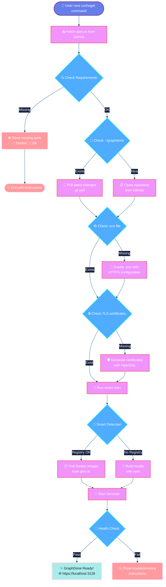
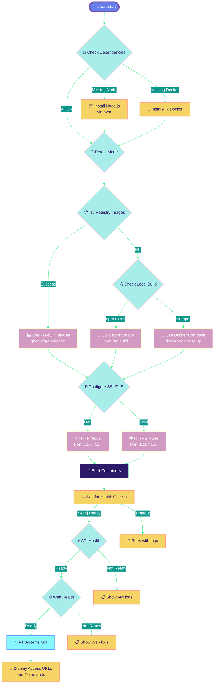
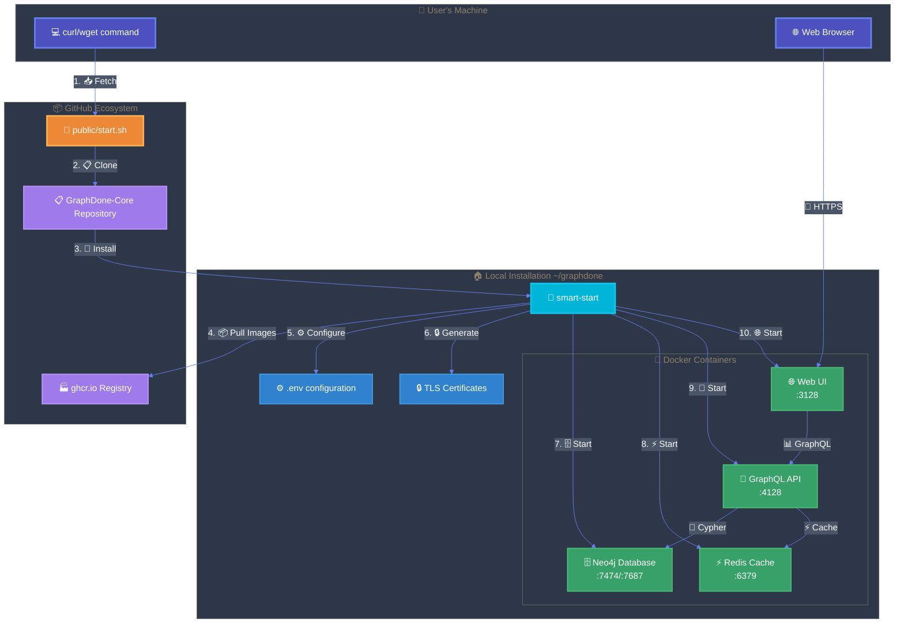
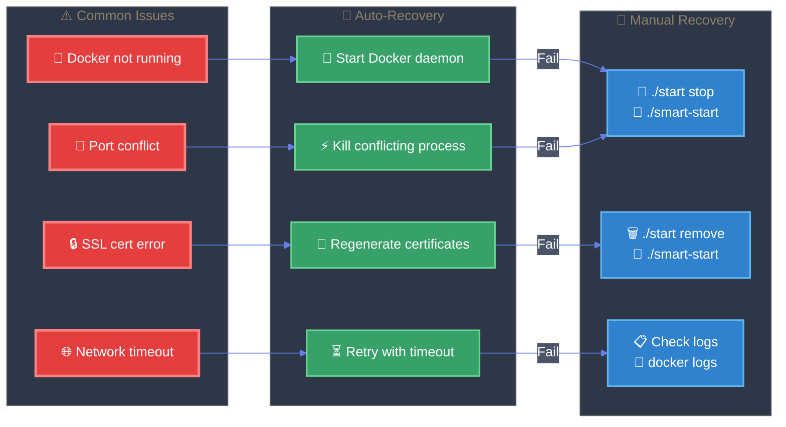
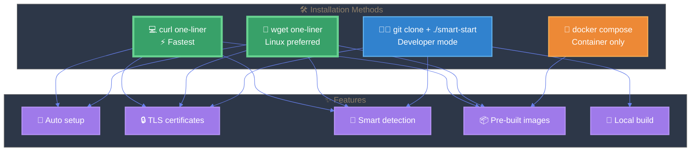

# 🚀 GraphDone Installation Flow

## One-Liner Installation Process

## 🧠 Smart-Start Decision Flow

## 🏗️ Service Architecture

## 🔄 Error Recovery Flow

## 🚀 Quick Start Options Comparison

## ⏱️ Installation Timeline

```mermaid
%%{init: {
  'theme': 'base',
  'themeVariables': {
    'primaryColor': '#2D3748',
    'primaryTextColor': '#FFFFFF',
    'primaryBorderColor': '#4A5568',
    'gridColor': '#718096',
    'background': '#1A202C',
    'altBackground': '#2D3748',
    'c0': '#38A169',
    'c1': '#3182CE', 
    'c2': '#9F7AEA',
    'c3': '#ED8936',
    'c4': '#E53E3E',
    'cScale0': '#38A169',
    'cScale1': '#3182CE',
    'cScale2': '#9F7AEA',
    'cScale3': '#ED8936',
    'cScale4': '#E53E3E'
  }
}}%%

gantt
    title 🚀 GraphDone Installation Timeline (~60 seconds)
    dateFormat ss
    axisFormat %Ss
    
    section 📥 Download
    📝 Fetch script           :done, fetch, 00, 1s
    📋 Clone repository       :done, clone, 01, 5s
    
    section ⚙️ Setup  
    🔍 Check requirements     :done, req, 06, 1s
    📄 Create .env           :done, env, 07, 1s
    🔒 Generate certificates  :done, cert, 08, 2s
    
    section 🐳 Docker
    🗄️ Pull Neo4j image      :active, neo4j, 10, 10s
    ⚡ Pull Redis image      :active, redis, 10, 3s
    🔌 Pull API image        :active, api, 10, 8s
    🌐 Pull Web image        :active, web, 10, 8s
    
    section 🚀 Start
    🗄️ Start Neo4j           :crit, startneo, 20, 15s
    ⚡ Start Redis           :startredis, 13, 2s
    🔌 Start API             :startapi, 35, 5s
    🌐 Start Web             :startweb, 40, 3s
    
    section ✅ Verify
    💚 Health checks         :milestone, 43, 5s
    🎯 Ready to use!         :milestone, 48, 0s
```

---

## 🎨 Visual Features

- **🌈 Modern Color Schemes**: Each diagram uses carefully curated color palettes for maximum visual impact
- **🎭 Dark Themes**: Professional dark backgrounds with high contrast text
- **📱 Responsive Design**: Diagrams scale beautifully across devices
- **🎯 Semantic Colors**: Error states (red), success (green), processes (blue/purple gradients)
- **✨ Rich Icons**: Contextual emojis make diagrams instantly readable
- **🔥 Gradient Borders**: Beautiful stroke gradients add depth and professionalism

## 📊 Technical Highlights

- **Custom Mermaid Themes**: Each diagram has unique theming for visual variety
- **Logical Color Coding**: Consistent meaning across all diagrams
- **Professional Typography**: High contrast white text on dark backgrounds
- **Modern Aesthetics**: Inspired by GitHub Dark, VS Code themes, and modern dashboards