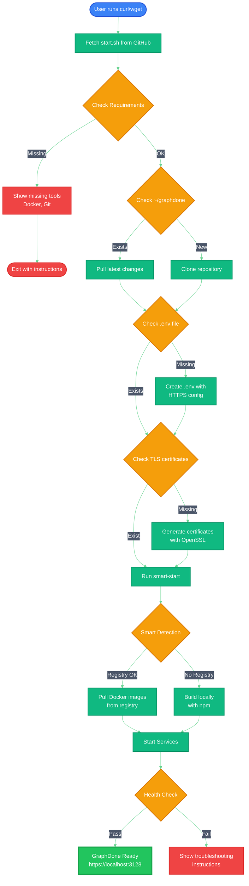
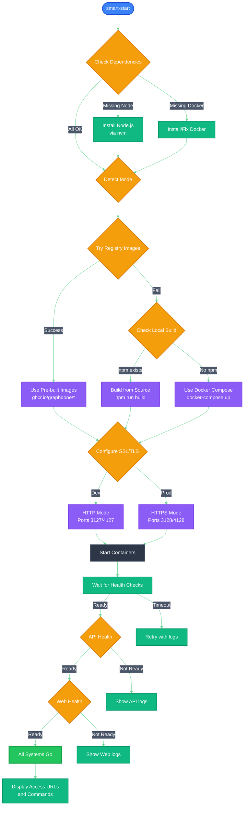
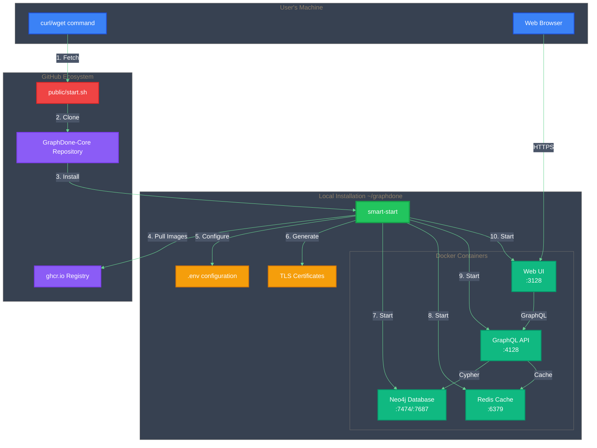
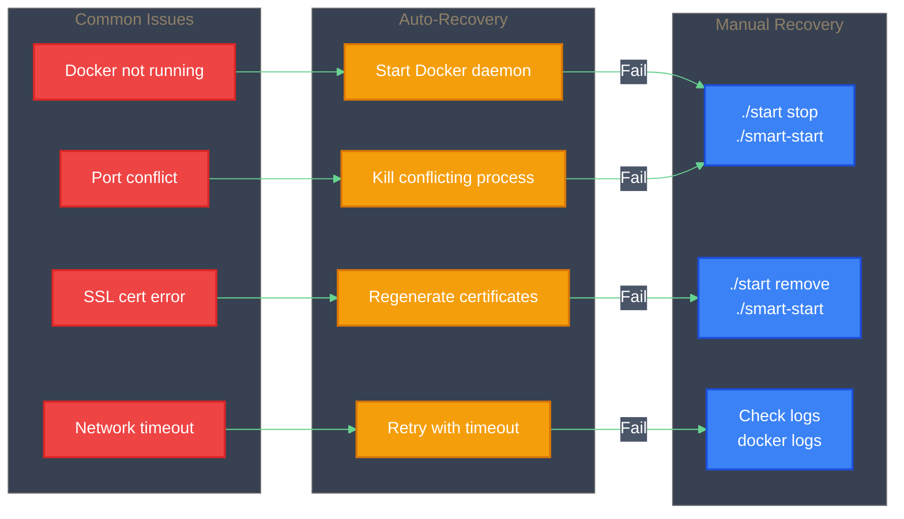
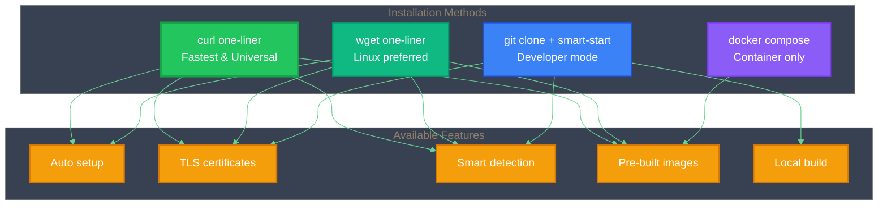

# 🚀 GraphDone Installation Flow

## One-Liner Installation Process

## Smart-Start Decision Flow

## Service Architecture

## Error Recovery Flow

## Installation Methods Comparison

## Installation Timeline

```mermaid
%%{init: {
  'theme': 'base',
  'themeVariables': {
    'primaryColor': '#2D3748',
    'primaryTextColor': '#FFFFFF',
    'primaryBorderColor': '#4A5568',
    'gridColor': '#4A5568',
    'background': '#1A202C',
    'altBackground': '#374151',
    'todayMarker': '#68D391',
    'c0': '#10B981',
    'c1': '#3B82F6',
    'c2': '#8B5CF6',
    'c3': '#F59E0B',
    'c4': '#EF4444',
    'c5': '#22C55E',
    'cScale0': '#10B981',
    'cScale1': '#3B82F6',
    'cScale2': '#8B5CF6',
    'cScale3': '#F59E0B',
    'cScale4': '#EF4444',
    'cScale5': '#22C55E'
  }
}}%%

gantt
    title 🚀 GraphDone Installation Timeline (~60 seconds)
    dateFormat ss
    axisFormat %Ss
    
    section 📥 Download
    📝 Fetch install script    :done, fetch, 00, 1s
    📋 Clone from GitHub       :done, clone, 01, 5s
    
    section ⚙️ Setup
    🔍 Check dependencies      :done, req, 06, 1s
    📄 Configure environment   :done, env, 07, 1s
    🔒 Generate TLS certs      :done, cert, 08, 2s
    
    section 🐳 Docker Images
    🗄️ Pull Neo4j (70MB)      :active, neo4j, 10, 10s
    ⚡ Pull Redis (15MB)       :active, redis, 10, 3s
    🔌 Pull API (120MB)        :active, api, 10, 8s
    🌐 Pull Web (80MB)         :active, web, 10, 8s
    
    section 🚀 Services
    🗄️ Start Neo4j DB         :crit, startneo, 20, 15s
    ⚡ Start Redis Cache       :startredis, 13, 2s
    🔌 Start GraphQL API       :startapi, 35, 5s
    🌐 Start Web Interface     :startweb, 40, 3s
    
    section ✅ Complete
    💚 Health check pass       :milestone, health, 43, 5s
    🎯 GraphDone ready!        :milestone, ready, 48, 0s
```

---

## Professional Design Features

### 🎯 **Optimized for Readability**
- **Clean white backgrounds** with subtle gray borders
- **High contrast dark text** (#1F2937) for maximum legibility
- **Minimal visual noise** - no unnecessary gradients or effects
- **Clear typography** that works at any zoom level

### 🎨 **Consistent Color System**
- **Blue (#3B82F6)**: Start points and user actions
- **Green (#10B981/#22C55E)**: Processes and success states  
- **Orange (#F59E0B)**: Decisions and configuration
- **Red (#EF4444)**: Errors and critical paths
- **Purple (#8B5CF6)**: Special modes and advanced features

### 📱 **Professional Standards**
- **Enterprise-ready**: Suitable for documentation and presentations
- **Accessibility compliant**: High contrast ratios (WCAG AA)
- **Print-friendly**: Works in both screen and print media
- **GitHub optimized**: Renders perfectly in GitHub's interface

### 🔍 **Enhanced Usability**
- **Reduced emoji usage** for professional environments
- **Clear node shapes** that indicate purpose (rectangles=actions, diamonds=decisions)
- **Logical flow direction** (top-down for processes, left-right for recovery)
- **Grouped elements** with subtle background differentiation